# ResumeGPT

<p align="center">
  
</p>

<p align="center">
  <a href="../README.md">English</a> ·
  <a href="./README.de.md">Deutsch</a> ·
  <a href="./README.fr.md">Français</a> ·
  <a href="./README.es.md">Español</a> ·
  <a href="./README.ja.md">日本語</a> ·
  <b>简体中文</b> ·
  <a href="./README.zh-TW.md">繁體中文</a>
</p>

<p align="center">
  <a href="https://resumegpt.tech-fun.net">项目主页</a>
</p>

ResumeGPT 是一个自托管的工作台,用于针对具体的职位机会定制简历和求职信。它把个人资料管理、职位跟踪、定时职位搜索、可复用的模板、可配置的 LLM Agent、PDF 生成、视觉审查以及后台任务监控整合在同一个应用里。

## 快速开始

安装好 Docker Compose 后,一条命令即可启动完整应用:

```bash
docker compose up -d
```

这条命令会直接拉取 CI 构建并发布好的 `latest` 镜像(见 [`.github/workflows/docker-publish.yml`](../.github/workflows/docker-publish.yml)),而不是本地重新构建,所以整套服务几秒钟就能起来。如果你正在改代码,想让 Compose 用本地代码构建 `api`、`worker`、`document-worker`、`web-worker`、`web` 这几个镜像,加上 `--build`:

```bash
docker compose up -d --build
```

不管用哪种方式,等服务就绪后打开 [http://localhost:5173](http://localhost:5173) 即可。Compose 会提供开发环境的默认配置、创建存储卷、执行数据库迁移,并等待各依赖服务变为健康状态。

## 功能

### 个人资料(Profiles)

- 创建和管理多个 Profile,每个都有名称、目标职位、默认语言和支持 Markdown 的内容。
- 直接输入 Profile 内容,或从 TXT、Markdown、TeX、DOC、DOCX、PDF、PNG、JPEG 文件导入。
- 在保存到 Profile 前审阅并编辑提取出的文本。
- 为支持照片的简历版式可选地添加 JPEG 或 PNG 头像。
- 在网页界面搜索、筛选、分页、编辑和删除 Profile。

### 职位机会(Job Opportunities)

- 记录职位名称、公司、地点、国家、城市、工作模式、雇佣类型、来源 URL、描述和申请状态。
- 手动创建职位机会,或一次性批量导入最多 50 个公开职位链接。
- 对支持的 LinkedIn 和 Indeed 页面使用快速的确定性解析。
- 对其他公开 HTTPS 职位页面,启用职位导入 Agent 做 AI 辅助解析。
- 直接在职位列表里编辑导入信息、更新申请状态。
- 按来源筛选职位,区分手动添加、URL 导入和 Job Hunter 发现的结果。
- 批量选择多个职位机会,一次性创建简历或求职信生成任务。

### Job Hunter

- 按职业方向、地点、工作模式、合同类型、经验年限、关键词和额外提示词,设置定期自动搜索。
- 可选地使用已保存的 Profile 作为匹配上下文。
- 每次运行最多发现 10 个新职位。
- 在网页界面运行、暂停、恢复、编辑或删除某个 Hunter。
- 在创建职位前对发现的 URL 去重。
- 把被拦截或无法解析的结果排除在职位列表之外,统一收集到确认收件箱里供人工复核。

### 模板(Templates)

- 分别管理简历和求职信模板。
- 上传 DOC、DOCX、单文件 TeX,或多文件的 LaTeX ZIP 工程。
- 当 ZIP 里没有唯一的 `main.tex` 时,可以指定 LaTeX 入口文件。
- 扫描上传的源文件、提取可供 LLM 读取的内容,并生成带缓存的 PDF 预览。
- 查看、更新、下载和删除自定义模板。
- 使用内置的只读 Rezume LaTeX 模板,应用内保留了其原始 [Overleaf 来源](https://www.overleaf.com/latex/templates/rezume/kfrvqywfkwjs)的署名信息。

### 简历与求职信生成

- 基于已保存的 Profile 和职位机会,生成量身定制的简历或求职信。
- 可选使用某个 LaTeX 模板,也可以不选模板,让 Document Designer Agent 直接设计出适合打印的 HTML/CSS 版式。
- 为每个 Agent 单独配置默认 LLM,也可以为某次生成整体指定一个模型来覆盖默认路由。
- 通过带边界限制的 LangChainGo Agent 执行器运行 Writer、Template Applying(或 Document Designer)、Visual Reviewer 这几个角色。
- 通过隔离的渲染工具生成 LaTeX 和 HTML/CSS 产物,以及 Word 模板预览。
- 将 PDF 页面栅格化用于视觉审查,并最多自动进行两轮版式修复。
- 当所选模型不支持视觉检查时,仍保留一份有效 PDF,并附带明显的提示。
- 当 AI 生成的文档无法可靠渲染时,回退到安全的基础版式。
- 在时间线中跟踪生成进度,查看草稿、中间产出的 PDF、审查反馈、警告以及用户提示。
- 编辑一次已完成或失败的生成的输入并重新生成,不会丢弃之前的时间线记录。
- 发送后续指令,对已完成的产物进行修订。

### LLM 供应商与设置

- 配置 OpenAI、OpenAI 兼容接口,以及本地 Ollama 供应商。
- API 令牌会加密存储,且不会以明文形式返回给浏览器。
- 通过 `/models` 或 Ollama 的 `/api/tags` 接口自动发现可用模型。
- 为 Writer、Template Applying、Document Designer、Visual Reviewer、Job Import、Job Hunter 这几个 Agent 分别指定默认供应商和模型。
- 针对单次生成,用一个模型覆盖默认路由。
- 配置界面语言,以及跟随系统 / 浅色 / 深色主题。
- 在设置里于英语、德语、法语、西班牙语、日语、简体中文、繁体中文之间切换界面语言。

### 后台处理与运维

- 通过基于 PostgreSQL 的持久化工作队列执行文档提取、模板准备、职位导入、Job Hunting 和文档生成。
- 恢复租约到期的任务、对临时性失败自动重试,并持久化任务生命周期事件。
- 在 Task Monitor 中查看任务状态、重试次数、经过脱敏的输入、错误信息和日志。
- 将源文件、头像、预览图和生成的 PDF 存储在 S3 兼容的对象存储中。
- 为核心写操作持久化事务性 Outbox 和审计记录。
- 输出结构化日志,以及符合 W3C trace-context 传播规范的 OpenTelemetry 追踪。
- 使用提供的脚本创建 PostgreSQL 备份,并执行自动化的恢复验证。

## 架构

已实现的组件模型、持久化布局、工作流和安全边界详见[架构文档](./architecture-design.md)。

## 界面截图

<table>
<tr>
<td width="50%">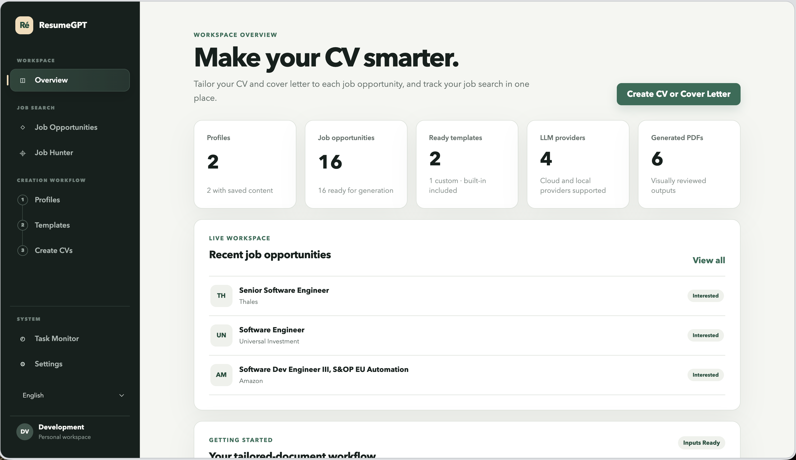<br><sub>工作区总览 — 一目了然地查看 Profile、职位机会、模板、供应商和已生成的 PDF。</sub></td>
<td width="50%">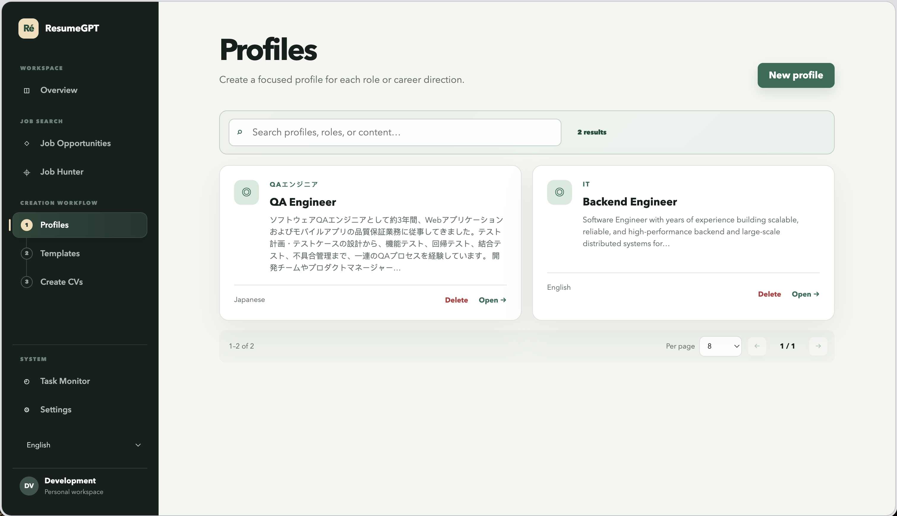<br><sub>Profiles — 每个职位方向对应一份聚焦的 Profile,带已保存内容和语言标记。</sub></td>
</tr>
<tr>
<td width="50%">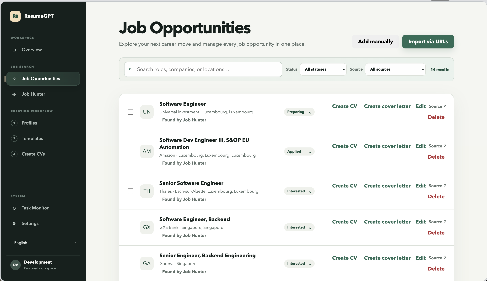<br><sub>职位机会列表 — 跟踪状态与来源,可对任意一条职位发起简历或求职信生成。</sub></td>
<td width="50%">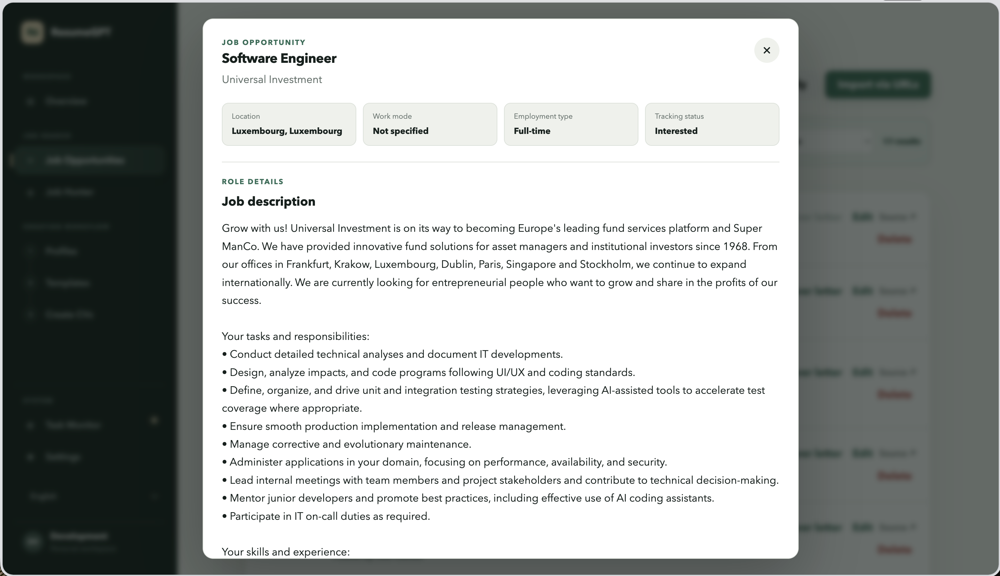<br><sub>职位机会详情 — 完整描述、地点、工作模式与跟踪状态。</sub></td>
</tr>
<tr>
<td width="50%">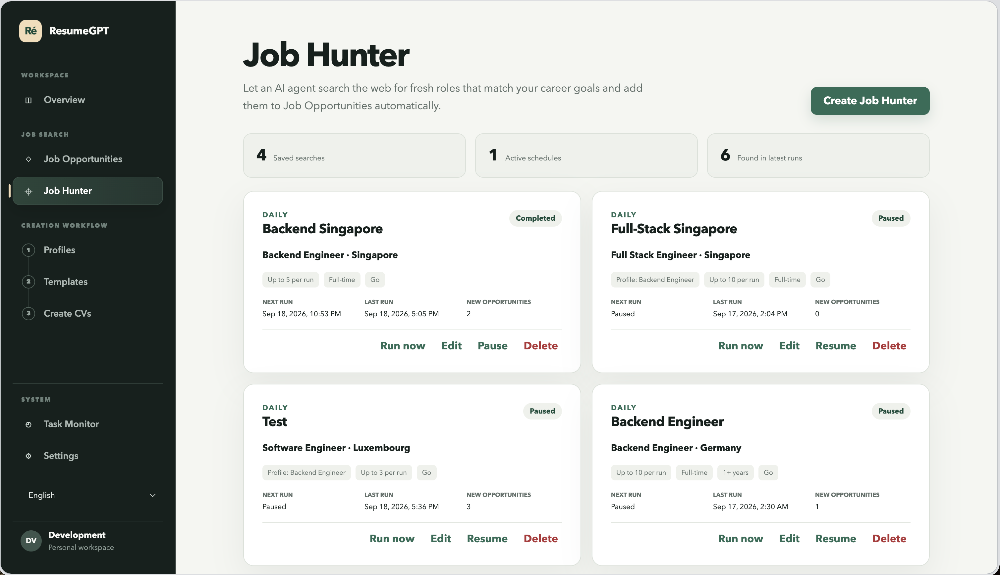<br><sub>Job Hunter — 定期自动搜索并发现新的职位机会。</sub></td>
<td width="50%">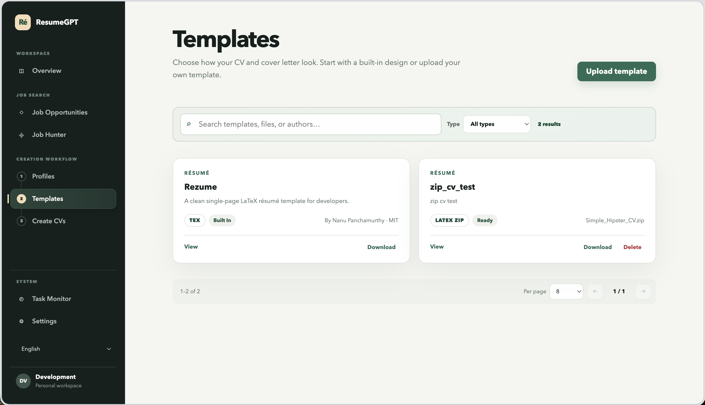<br><sub>模板 — 内置的 Rezume LaTeX 模板与上传的自定义模板并列展示。</sub></td>
</tr>
<tr>
<td width="50%">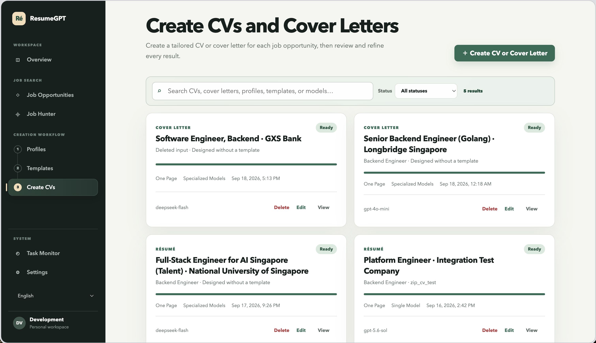<br><sub>创建简历与求职信 — 每次生成任务的状态、所用模型与模板一览。</sub></td>
<td width="50%">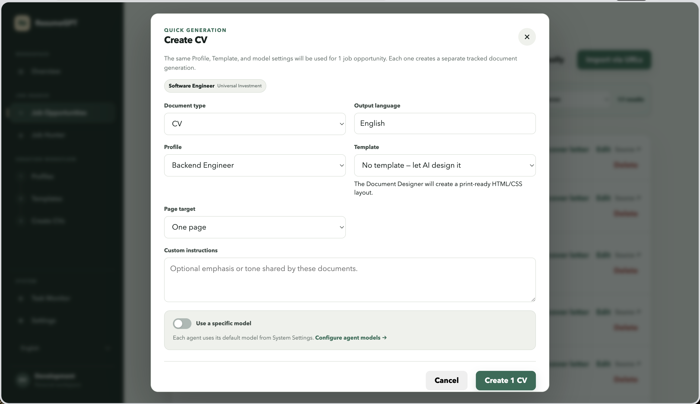<br><sub>快速生成 — 直接从某条职位机会发起简历或求职信生成。</sub></td>
</tr>
<tr>
<td width="50%">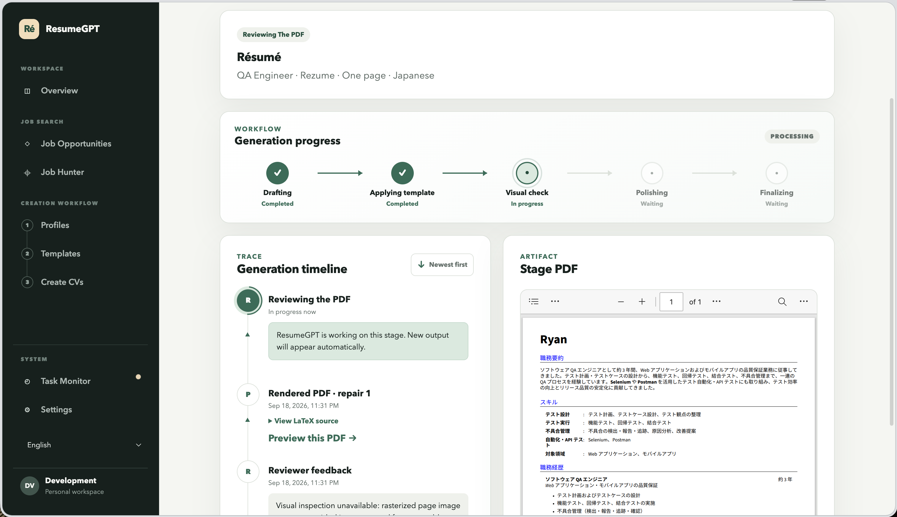<br><sub>生成进度实时跟踪,附带分阶段的 PDF 预览,这里展示的是一份日语简历。</sub></td>
<td width="50%">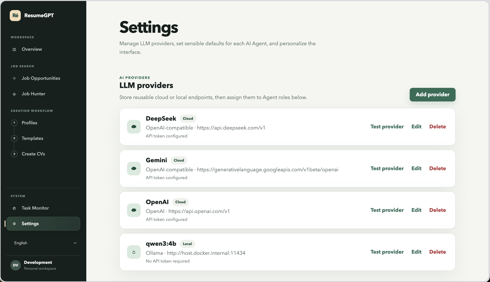<br><sub>设置 — 已配置的 LLM 供应商,涵盖云端与本地。</sub></td>
</tr>
<tr>
<td width="50%">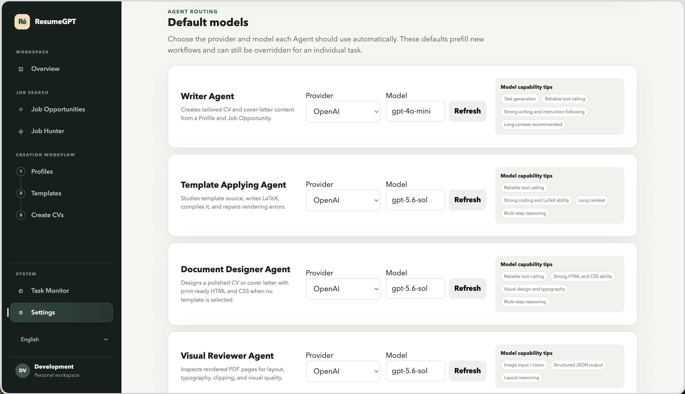<br><sub>设置 — 按 Agent 角色分别配置的默认模型路由。</sub></td>
<td width="50%">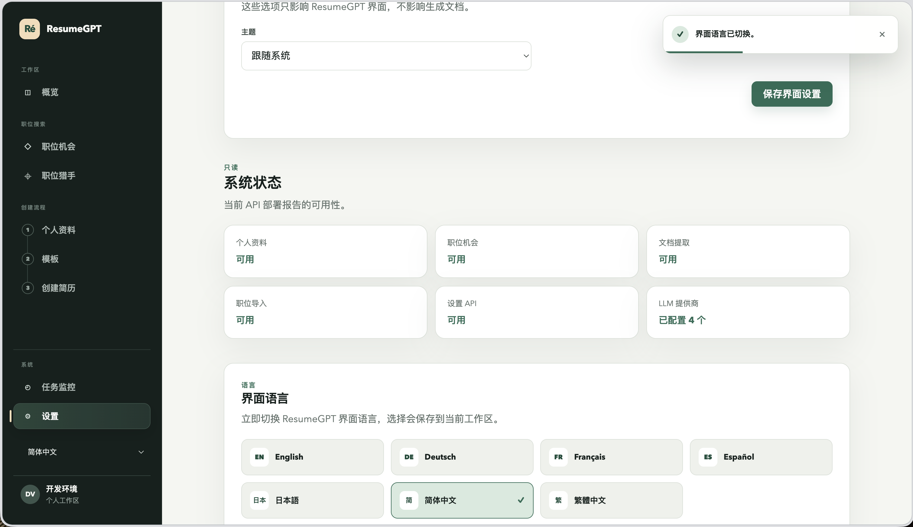<br><sub>设置 — 界面语言切换,这里展示的是简体中文界面。</sub></td>
</tr>
<tr>
<td width="50%">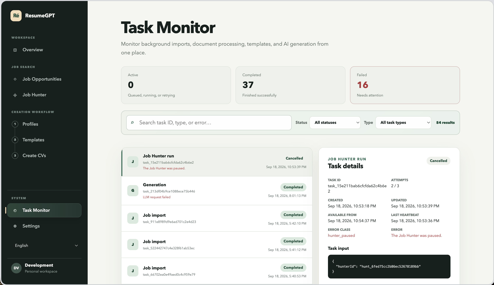<br><sub>Task Monitor — 后台任务历史记录及每个任务的详细信息。</sub></td>
<td width="50%"></td>
</tr>
</table>

## 本地服务栈

默认的 Compose 部署包含以下服务:

| 服务 | 作用 | 本地访问方式 |
|---|---|---|
| `web` | 由 Nginx 提供服务的 Vue 3 应用 | `http://localhost:5173` |
| `api` | Go 编写的 HTTP API | `http://localhost:8080` |
| `worker` | 持久化的后台处理器与调度器 | 仅内部访问 |
| `document-worker` | 恶意软件扫描、内容提取、OCR、预览与 PDF 渲染 | 仅内部访问 |
| `web-worker` | 用于 AI 辅助导入的隔离 Playwright 页面渲染 | 仅内部访问 |
| `postgres` | 应用数据、队列、事件与设置 | `localhost:5432` |
| `redis` | 供应商模型发现结果的带过期缓存 | `localhost:6379` |
| `minio` | S3 兼容的对象存储 | API `localhost:9000`,控制台 `localhost:9001` |
| `migrate` | 一次性的数据库迁移进程 | 仅内部访问 |
| `pgadmin` | 用于查看/调试 Postgres 数据库的 Web 界面 | `http://localhost:5050` |

查看状态或跟踪日志:

```bash
docker compose ps
docker compose logs -f
```

停止服务栈但不删除数据:

```bash
docker compose down
```

PostgreSQL、Redis 和 MinIO 的数据都保留在具名卷中。只有在你确实想清除本地应用数据时,才使用 `docker compose down --volumes`。

## 首次使用

1. 打开 `http://localhost:5173/settings`。
2. 添加一个 OpenAI、OpenAI 兼容接口或 Ollama 供应商并测试。
3. 为你打算使用的 Agent 选择默认模型。
4. 创建一个 Profile 并保存你的源内容。
5. 添加或导入一个职位机会。
6. 创建简历或求职信,可选地指定一个模板。

如果 Ollama 运行在 Docker 宿主机上,Base URL 请使用 `http://host.docker.internal:11434`。

## 配置

Compose 已经提供了开发环境的默认值,所以 `.env` 文件不是必需的。如果你想自定义端口、凭证、存储、认证或链路追踪,复制一份 `.env.example`:

```bash
cp .env.example .env
```

主要的配置项包括:

| 变量 | 作用 |
|---|---|
| `WEB_PORT` | 面向浏览器的 Web 端口,默认 `5173` |
| `API_PORT` | 面向浏览器的 API 端口,默认 `8080` |
| `POSTGRES_*` | 本地 PostgreSQL 数据库及其凭证 |
| `REDIS_PORT`、`MODEL_CACHE_TTL` | Redis 端口以及 LLM 供应商模型缓存的有效期 |
| `MINIO_ROOT_USER`、`MINIO_ROOT_PASSWORD` | 本地对象存储的凭证 |
| `SETTINGS_ENCRYPTION_KEY` | 用于加密存储的 LLM API 令牌 |
| `AUTH_MODE` | `development` 或 `oidc` |
| `OIDC_ISSUER`、`OIDC_CLIENT_ID` | 当 `AUTH_MODE=oidc` 时必填 |
| `OTEL_EXPORTER_OTLP_ENDPOINT` | 可选的 OpenTelemetry 采集端点 |

内置的加密密钥和存储凭证仅用于开发环境。在本地机器之外使用本应用前,请设置你自己的私有值。

## 开发

本地宿主机开发需要 Go 1.26.8 及以上、Node.js 22 及以上、Python 3.12、`uv` 和 GNU Make。

安装前端和 Python 依赖:

```bash
npm --prefix apps/web install
cd services/document-worker && uv sync --dev --locked && cd ../..
cd services/web-worker && uv sync --dev --locked && cd ../..
```

启动 PostgreSQL 和 MinIO、执行迁移,并在不同终端里分别运行各主进程:

```bash
cp .env.example .env
make compose-infra
make migrate
make dev-api
make dev-worker
make dev-web
```

完整的 worker 还依赖 document-worker 和 web-worker。要做端到端开发,最简单的方式是直接使用完整的 Compose 服务栈。

运行校验:

```bash
make test
make build
```

常用命令:

```bash
make compose-up
make compose-ps
make compose-logs
make compose-down
make backup
make restore-check
```

## 仓库结构

```text
apps/web/                   Vue 3 + TypeScript 前端
cmd/api/                    Go API 入口
cmd/worker/                 Go 后台 worker 入口
cmd/migrate/                内嵌的迁移执行器
internal/                   领域模块、服务、端口与适配器
migrations/                 版本化的 PostgreSQL 迁移脚本
services/document-worker/   独立的文档处理与渲染服务
services/web-worker/        独立的 Playwright 浏览器服务
scripts/                    备份与恢复校验相关脚本
docs/                       当前的架构文档
```

## 许可

ResumeGPT 依据 [LICENSE](../LICENSE) 中的条款分发。内置的 Rezume 模板在应用内保留其自身的署名和许可信息。
