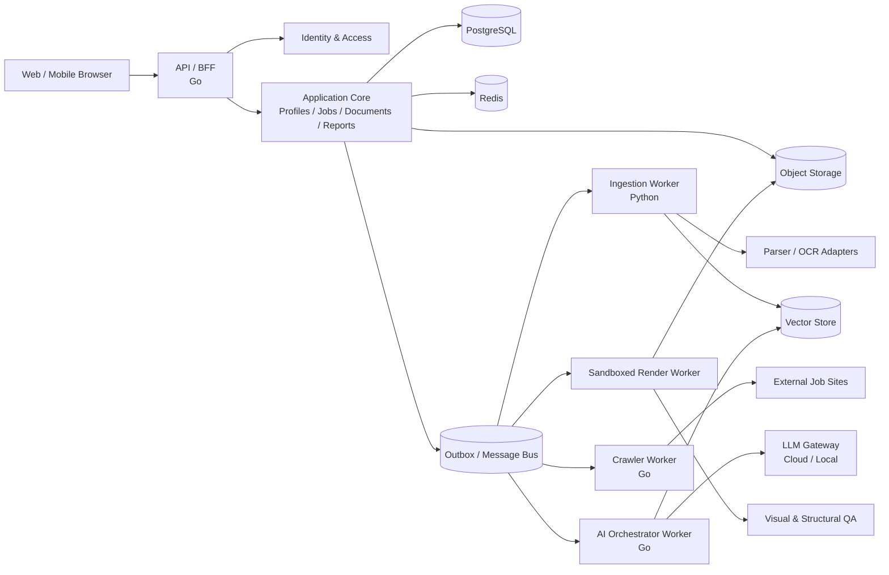
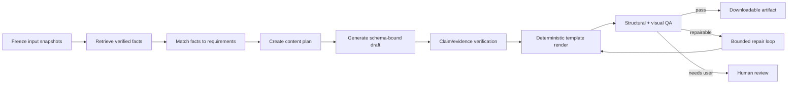

# ResumeGPT Architecture Design

> Status: Draft  
> Target stage: Prototype / MVP, with a path to cloud-native distributed deployment  
> Primary product language: English, with support for additional locales  
> Last updated: 2026-09-13

## 1. Goals and Design Principles

ResumeGPT uses verified applicant background data and job postings to generate, optimize, and manage tailored CVs and cover letters. In addition to producing high-quality content, the system must preserve provenance, minimize fabricated claims, and reliably execute long pipelines involving file parsing, web crawling, LLM calls, template rendering, and visual validation.

Core principles:

1. **Facts first:** Models generate only from user-confirmed facts. Every material claim should be traceable to evidence.
2. **Business logic is infrastructure-independent:** LLMs, object storage, relational/vector databases, message systems, parsers, and renderers are accessed through ports and adapters.
3. **Start as a modular monolith, split by evidence:** The MVP uses a modular API plus independently deployable workers. Extract services only where scaling, security, ownership, or reliability requires it.
4. **Asynchronous and recoverable:** Long-running work uses durable jobs with idempotency, retries, deadlines, cancellation, and recovery.
5. **Structured generation first:** LLMs produce schema-constrained content; deterministic template engines produce DOCX, TeX, and PDF.
6. **Privacy by default:** Minimize collection and design tenant isolation, encryption, audit, export, and deletion from the outset.
7. **Observable, replaceable, and testable:** Record model, prompt, input snapshot, cost, latency, and quality signals so provider changes and regressions are measurable.

## 2. Scope and Non-Goals

### 2.1 MVP Scope

- Multiple profiles and source submission through PDF, DOC/DOCX, TeX, TXT, PNG, JPG/JPEG, and direct text.
- Parsing, OCR, fact extraction, human confirmation, versioning, and retrieval.
- Single or batch job URL import plus manual job entry.
- Job details, tags, application-state tracking, and basic reporting.
- CV generation and revision by profile, job, template, and page constraint.
- Cover-letter generation and revision by profile and job.
- DOCX/PDF output, plus TeX template input and PDF output.
- Fact validation, layout validation, visual checks, version comparison, and download.
- Multiple cloud providers and local models exposed through compatible adapters.
- English-first UI with independent UI and document-language selection.

### 2.2 MVP Non-Goals

- Automated application submission, automatic login to job sites, or bypassing access restrictions.
- Sending email, applying, or mutating an external ATS without explicit user action.
- Training or fine-tuning a foundation model.
- Universal pixel-perfect support for arbitrary PDF, DOCX, or TeX templates. The MVP supports a validated subset.

## 3. Recommended Architecture

### 3.1 Prototype Deployment Shape

Use a **modular-monolith API, asynchronous workers, and an isolated rendering sandbox**:

- `web-app`: TypeScript and Vue 3.
- `api`: Go domain logic, REST/JSON API, authorization, and workflow entry points.
- `worker-go`: crawling, orchestration, notifications, and reporting aggregation.
- `document-worker`: Python OCR, document parsing, selected NLP utilities, and PDF image analysis.
- `render-worker`: isolated LibreOffice, LaTeX, Chromium, and font toolchain.
- PostgreSQL: system of record.
- Object storage: uploads, artifacts, previews, and diagnostic attachments; MinIO is suitable locally.
- Redis: caching, rate limits, ephemeral state, and distributed locks; never the sole record of business facts.
- Messaging: begin with PostgreSQL Outbox and lightweight workers; add Kafka when multiple consumers or throughput justify it.
- Vector search: begin with PostgreSQL and pgvector; switch through an adapter to Qdrant when measured scale requires it.



### 3.2 Why Not Start with Full Microservices

Before domain boundaries and workload profiles stabilize, full microservices add service discovery, distributed transactions, event compatibility, integration testing, observability, and operations overhead. A modular monolith preserves code boundaries while allowing high-risk and compute-heavy workers to deploy separately.

Extract a service when:

- Crawling, OCR, or rendering needs a distinct resource or isolation policy.
- Generation and interactive API traffic require different SLOs.
- A domain needs an independent team, release cadence, or governance boundary.
- Profiling shows a module is a bottleneck and vertical scaling is uneconomical.

## 4. Domains and Module Boundaries

| Module | Responsibilities | Core entities |
|---|---|---|
| Identity & Tenant | Authentication, sessions, workspaces, membership, RBAC, quotas | User, Workspace, Membership |
| Profile | Profiles, source material, fact confirmation, versioning | Profile, SourceDocument, Evidence, Fact |
| Job | URL/manual import, normalization, snapshots | Job, JobSource, JobSnapshot, Requirement |
| Application Tracking | Status, timeline, notes, reminders, statistics | Application, StatusEvent, Note |
| Template | DOCX/TeX templates, capabilities, page constraints, versions | Template, TemplateVersion, RenderProfile |
| Content Generation | Planning, retrieval, generation, conversational revision | Generation, ArtifactDraft, Revision, Conversation |
| Validation | Facts, content rules, ATS, layout, and visual validation | ValidationRun, Finding, EvidenceLink |
| Artifact | Rendering, preview, conversion, download, retention | Artifact, FileVariant, RenderRun |
| Reporting | Funnel, conversion, activity trends, export | Report, MetricSnapshot |
| Platform | Providers, jobs, audit, configuration, notification, throttling | ProviderConfig, JobRun, AuditEvent |

Modules communicate through application interfaces and domain events. They must not directly read another module's private tables. Initially they may share a PostgreSQL instance, but table ownership must be separated by schema or explicit naming.

## 5. Layers and Adapter Design

Use hexagonal architecture:

```text
Transport (HTTP / Event Consumer / CLI)
                 |
Application Use Cases + Workflow Orchestration
                 |
Domain Model + Policies + Interfaces (Ports)
                 |
Infrastructure Adapters
(Postgres / Qdrant / Kafka / LLM / S3 / OCR / Renderer)
```

The business layer depends only on interfaces it owns:

```go
type TextGenerator interface {
    Generate(ctx context.Context, req GenerateRequest) (GenerateResult, error)
    Stream(ctx context.Context, req GenerateRequest) (TokenStream, error)
    Capabilities(ctx context.Context) ModelCapabilities
}

type EmbeddingProvider interface {
    Embed(ctx context.Context, texts []string) ([]Vector, error)
}

type VectorIndex interface {
    Upsert(ctx context.Context, entries []VectorEntry) error
    Search(ctx context.Context, query VectorQuery) ([]VectorMatch, error)
    DeleteNamespace(ctx context.Context, namespace string) error
}

type BlobStore interface {
    Put(ctx context.Context, object BlobObject) (BlobRef, error)
    Open(ctx context.Context, ref BlobRef) (io.ReadCloser, error)
    SignedDownloadURL(ctx context.Context, ref BlobRef, ttl time.Duration) (string, error)
}
```

Define ports for:

- `LLMProvider`, `EmbeddingProvider`, and `Reranker`.
- Profile, Job, and Artifact repositories.
- `VectorIndex`, `BlobStore`, `Cache`, and `EventBus`.
- `DocumentParser`, `OCRProvider`, and `JobPageFetcher`.
- `TemplateRenderer`, `VisualInspector`, and `MalwareScanner`.
- `IdentityProvider`, `SecretStore`, and `TelemetrySink`.

Business objects refer to logical model aliases such as `writing-balanced-v1`, not vendor model names. Policy maps aliases to provider, version, region, timeout, budget, and fallback chain.

## 6. Core Data Model

Primary tables include an ID (UUID/ULID), `workspace_id`, timestamps, and an appropriate version. User content uses soft deletion followed by policy-controlled hard deletion; audit retention is managed separately.

### 6.1 Profiles and Fact Repository

- `profiles`: name, domain, default language, description, and state.
- `profile_sources`: upload/text metadata, object reference, hash, parsing state, and source type.
- `source_segments`: source text, page/paragraph/coordinates, language, and parser version.
- `facts`: normalized employment, education, project, skill, certification, and achievement facts.
- `fact_evidence_links`: links from fact versions to source segments.
- `fact_versions`: original/revised values, confirmation state, and validity period.
- `profile_fact_links`: allows profiles to share facts without copying them.

Use relational common fields plus typed JSONB payloads:

```text
Fact {
  type: employment | education | project | skill | achievement | ...
  canonical_data: JSONB
  confidence: decimal
  verification_status: extracted | user_confirmed | disputed | rejected
  sensitivity: normal | personal | highly_sensitive
}
```

Only user-confirmed facts, or high-confidence facts permitted by explicit policy, are candidates for final output. Unconfirmed facts must be visible and require confirmation.

### 6.2 Jobs and Application Tracking

- `jobs`: normalized title, company, location, work mode, and language.
- `job_sources`: URL/manual input, crawl policy, acquisition time, and content hash.
- `job_snapshots`: immutable source snapshots so generation remains reproducible.
- `job_requirements`: responsibilities, must-haves, nice-to-haves, keywords, seniority, and language.
- `applications`: profile, job, current state, channel, priority, and deadline.
- `application_status_events`: append-only state timeline.

Default state machine:

```text
interested -> preparing -> applied -> screening -> interview -> offer -> accepted
                              |            |          |
                              +----------> rejected <-+
interested/preparing/applied -> withdrawn
```

Workspaces may customize states, but reporting maps them to standard stages.

### 6.3 Generations and Artifact Versions

- `generations`: task configuration and immutable input-snapshot references.
- `generation_inputs`: fact, job snapshot, template, prompt, and language versions.
- `artifact_drafts`: structured CV/cover-letter content conforming to versioned JSON Schema.
- `artifact_revisions`: parent revision, instruction, diff, and author type.
- `evidence_claims`: final claims, fact/evidence references, and validation result.
- `render_runs`: renderer/template versions, logs, state, and duration.
- `file_variants`: PDF, DOCX, TeX, and preview-object references.
- `validation_runs/findings`: content, fact, layout, and security findings.

Record provider, model version, prompt-template version, sampling parameters, and input hash. Raw sensitive prompts follow privacy retention policy.

## 7. Core Workflows

### 7.1 Background-Data Ingestion

1. Validate type, size, and quota; hash the content and upload it to quarantine.
2. Scan malware, real MIME type, archive bombs, and malicious macros.
3. Create a durable ingestion job and return a pollable/subscribable job ID.
4. Extract text and source location with parsers/OCR.
5. Detect language, normalize, classify sensitivity, and segment text.
6. Extract candidate facts into a schema; validate dates, units, and fields deterministically.
7. Link facts to evidence, generate embeddings, and update the vector index.
8. Ask the user to resolve low-confidence, conflicting, or sensitive facts.

On failure, retain the source and actionable error state. Let the user correct extracted text rather than invalidating the entire profile.

### 7.2 Job Acquisition

1. Normalize and deduplicate the URL; apply SSRF and domain-policy checks.
2. Prefer ordinary HTTP; use a constrained headless browser only for necessary dynamic pages.
3. Respect robots rules, terms, rate limits, authentication boundaries, and CAPTCHA.
4. Remove scripts and untrusted instructions; retain visible job content and required metadata.
5. Save an immutable source snapshot and normalize title, company, location, responsibilities, and requirements.
6. Flag removed, duplicate, or incomplete postings and allow manual correction.

Web content is untrusted data. Text telling the model to ignore policy or reveal user information never becomes an instruction.

### 7.3 CV and Cover-Letter Generation



- Retrieval always filters by workspace, profile, and source version.
- Build a requirement-to-fact matching matrix before writing. Missing qualifications cannot be invented.
- Output must conform to the CV/cover-letter IR schema.
- Every experience, number, date, organization, institution, and certificate becomes an evidence-linked claim.
- Stronger wording may improve presentation but cannot invent metrics; use non-quantified language when no number is supported.
- User prompts may change style and emphasis, but cannot override truthfulness, security, or tenant isolation.

### 7.4 Conversation and Revision

- Bind a conversation to an artifact revision.
- Every AI change creates a new revision; previous versions remain restorable.
- Use constrained operations such as `replace_bullet`, `reorder_section`, and `shorten_summary`.
- Show semantic, layout, and claim-level diffs.
- Record manual edits as revisions and allow users to lock sections.
- Rerun fact and render validation before every final download.

## 8. LLM Gateway and Model Policy

### 8.1 Unified Request Model

Normalize chat/responses, streaming, structured JSON, tool calls, context limits, languages, vision, residency, timeouts, retries, concurrency, cost budgets, safety settings, retention, telemetry, and provider error classes.

Providers differ in JSON Schema, vision, and tool support. A use case declares capabilities and the router selects an eligible model.

### 8.2 Provider Adapters

- Implement native cloud adapters and an OpenAI-compatible adapter where appropriate.
- Connect local models through Ollama, vLLM, or another controlled endpoint.
- Configure generation and embedding providers independently.
- Store secrets in a secret manager, never plaintext database fields, logs, or clients.

### 8.3 Routing and Degradation

| Logical model | Use | Required properties |
|---|---|---|
| `extract-structured` | Fact/job extraction | Reliable JSON, low temperature, multilingual |
| `write-quality` | CV/letter writing | Strong instruction following and long context |
| `verify-claims` | Evidence validation | Structured decisions and evidence references |
| `vision-layout` | Visual page review | Vision, optional |
| `embed-retrieval` | Semantic retrieval | Multilingual embeddings |

Fallback is allowed only between deployments with equivalent capabilities, security, and residency. Check whether a provider already completed a request before retrying, and persist each generation step under an idempotency key.

## 9. Templates, Rendering, and Visual Validation

### 9.1 Intermediate Representation

Use format-independent `ResumeDocument` and `CoverLetterDocument` JSON Schemas containing sections, blocks, style tokens, evidence references, and pagination hints. Templates map the IR to DOCX or TeX.

Template admission validates:

- File format and macro safety.
- Placeholders and schema compatibility.
- Font availability and licensing.
- Rendering with deterministic fixture data.
- Capabilities such as photo, columns, project count, and headers.

### 9.2 Rendering

- DOCX: populate a controlled template, then convert with isolated LibreOffice.
- TeX: compile an allowlisted template/package set in a networkless, resource-limited container.
- PDF: authoritative delivery/preview format; rasterize each page for visual analysis.
- Templates cannot use shell escape, arbitrary macros, external downloads, or host filesystem access.

### 9.3 Validation Dimensions

Prefer deterministic checks; use vision models as a supplement:

- Target pages, blank pages, overflow, clipping, overlap, and margins.
- Missing fonts, corrupt glyphs, anomalous type size, and contrast.
- Section completeness, links, and date consistency.
- Widows/orphans, headings at page bottoms, excess whitespace, and bullet alignment.
- Text density, hierarchy, and ATS compatibility.
- Normalized PDF text versus IR content to detect lost text.

Limit automatic repairs to two attempts. If constraints still fail, present findings and let the user shorten content, switch templates, or accept the result.

## 10. AI Security and Fabrication Prevention

### 10.1 Threat Model

- Prompt injection in uploads, job pages, and user prompts.
- Fabricated experience, education, skill, metrics, dates, or contact information.
- Cross-user or cross-profile retrieval leakage.
- Malicious DOCX/TeX, parser vulnerabilities, SSRF, and browser escapes.
- Third-party retention or training on personal data.
- PII leakage through logs, traces, and errors.
- Bias, discriminatory inference, or inappropriate use of sensitive traits.

### 10.2 Anti-Fabrication Controls

1. Preserve source segment, page, coordinates, or user-entry provenance for facts.
2. Separate extracted facts from user-confirmed facts.
3. Retrieve only facts permitted for the active workspace/profile.
4. Require `fact_ids` on generated claims; claims without evidence fail by default.
5. Deterministically compare names, dates, numbers, and enumerated values.
6. Use an independent semantic check for unsupported expansion, but never an LLM as the sole judge.
7. Treat identity, organization, title, dates, education, certification, and metrics as blocking-risk claims.
8. Require user confirmation for disputed or newly asserted facts.
9. Block `Verified` export with unresolved claims; explicit unverified export is audited and policy-controlled.

```json
{
  "text": "Reduced report preparation time by 30% through automation.",
  "fact_ids": ["fact_01..."],
  "evidence_ids": ["segment_01..."],
  "verification": "verified",
  "risk": "high"
}
```

### 10.3 Prompt-Injection Isolation

- Separate system policy, user instructions, profile facts, and job text into explicit trust boundaries.
- Uploaded and crawled text is always untrusted and cannot invoke tools.
- Tools use an allowlist, typed arguments, and server-side authorization. Models cannot choose arbitrary URLs, SQL, paths, or workspace IDs.
- Enforce retrieval scope in storage/repository code, not through model instructions.
- Persist official revisions only after schema, content-policy, and evidence validation.

## 11. Security, Privacy, and Compliance Baseline

- OIDC/OAuth 2.1 authentication; short-lived workload identity for service-to-service access.
- Workspace scoping in repositories plus PostgreSQL RLS as defense in depth.
- TLS in transit and encryption for databases, object storage, backups, and sensitive fields at rest.
- Short-lived signed upload/download URLs and unguessable object IDs.
- Audit upload, download, generation, export, deletion, and provider changes.
- Redact logs; never log full CVs, JDs, prompts, model responses, or signed URLs.
- Support export and deletion across database, object store, vector index, caches, and backups according to retention.
- Show provider processing/residency settings; allow a sensitive profile to require local models.
- Disable public sharing by default; make any link revocable, expiring, and auditable.
- Perform a formal GDPR/UK GDPR assessment for target markets; retain consent, purpose, and retention fields even in the prototype.

## 12. Asynchronous Work, Errors, and Fault Tolerance

### 12.1 Job State

```text
queued -> running -> succeeded
             |  \-> retry_wait -> running
             +---> failed
             +---> cancelled
```

Each job records type, idempotency key, input references, attempt count, maximum retries, deadline, heartbeat, error class, and trace ID. Store large payloads in object storage.

### 12.2 Consistency

- Write business data and outbox events in one PostgreSQL transaction.
- Publish the outbox to messaging; consumers use inbox/deduplication records.
- Use at-least-once delivery and idempotent effects.
- Artifact versions are immutable; state transitions use optimistic locking.
- The vector index is rebuildable derived data with source/index state in PostgreSQL.

### 12.3 Error Policy

| Error | Handling |
|---|---|
| Invalid schema or unsupported file | No retry; return an actionable message |
| Provider 429 or transient 5xx | Exponential backoff with jitter; honor Retry-After |
| Timeout/network interruption | Bounded retry with idempotency |
| Authentication, balance, or policy rejection | Fail fast and notify the appropriate party |
| Parser crash or malicious input | Quarantine and record a security event |
| Page constraint failure | Bounded repair, then human decision |
| Kafka/Qdrant unavailable | Retain outbox work; PostgreSQL remains authoritative |

Also use circuit breakers, bulkheads, provider concurrency limits, leases/heartbeats, dead-letter handling, audited replay, and graceful shutdown.

## 13. API and Events

### 13.1 External API

Use versioned REST for the MVP, SSE for generation progress, and signed URLs for uploads:

```text
POST   /v1/profiles
POST   /v1/profiles/{id}/sources
GET    /v1/profiles/{id}/facts
PATCH  /v1/facts/{id}

POST   /v1/jobs/imports
POST   /v1/jobs
GET    /v1/jobs/{id}
PATCH  /v1/applications/{id}/status

POST   /v1/generations
GET    /v1/generations/{id}
POST   /v1/artifacts/{id}/revisions
POST   /v1/artifacts/{id}/render
GET    /v1/artifacts/{id}/events
GET    /v1/artifacts/{id}/downloads/{format}

GET    /v1/reports/application-funnel
```

Mutations support `Idempotency-Key`. Async creation returns `202 Accepted`, a resource ID, and job URL. Errors return a stable code, message, retryable flag, field errors, and trace ID.

### 13.2 Domain Events

- `profile.source.uploaded.v1`
- `profile.facts.extracted.v1`
- `job.snapshot.captured.v1`
- `generation.requested.v1`
- `artifact.draft.created.v1`
- `artifact.render.completed.v1`
- `validation.completed.v1`
- `application.status.changed.v1`

Events contain only necessary IDs, versions, and non-sensitive metadata. Do not broadcast full CVs or PII through Kafka. Event schemas require compatibility policy and a registry.

## 14. Technology Choices

| Layer | MVP recommendation | Evolution | Notes |
|---|---|---|---|
| Web | TypeScript, Vue 3, Vite, Pinia, Vue Router | Nuxt if SSR is needed | SSE fits generation progress; use i18n keys from day one |
| API/domain | Go | Continue with Go | Strong typing, concurrency, and simple deployment |
| Document/OCR | Python worker | Dedicated service | Better document/OCR ecosystem without contaminating the Go domain |
| Workflow | PostgreSQL jobs + Outbox | Temporal or equivalent | Add durable workflow infrastructure only when complexity warrants it |
| OLTP | PostgreSQL | Managed PostgreSQL | System of record; JSONB for evolving typed payloads |
| Vector | pgvector | Qdrant cluster | Keep behind `VectorIndex` |
| Cache | Redis when needed | Managed compatible service | Cache, rate limiting, and short locks only |
| Events | Outbox polling | Kafka | Add when event volume/consumer count requires it |
| Objects | MinIO / S3-compatible | Cloud object storage | One `BlobStore` contract |
| Rendering | Sandboxed LibreOffice + TeX + PDF tools | Dedicated render fleet | Pin tools, fonts, and image versions |
| LLM | Provider adapters + local compatible adapter | Policy routing and multi-region | Provider SDK types stay out of business code |
| Auth | Established OIDC provider | Enterprise SSO/SCIM | Do not build a password system |
| Observability | OpenTelemetry, Prometheus/Grafana, structured logs | Managed platform | Trace API, queue, LLM, and rendering end to end |

### 14.1 Go/Python Boundary

Go owns business policy, authorization, orchestration, state machines, APIs, and consistency. Python handles isolated tasks where its ecosystem has a clear advantage, such as OCR, document-structure extraction, and image analysis. Communication uses versioned events or gRPC/HTTP contracts; Python workers do not directly mutate Go-owned business tables.

## 15. Frontend and Internationalization

- English is the default UI locale; use BCP 47 tags such as `en-US`, `de-DE`, and `zh-CN`.
- Store UI locale, profile-content language, job-source language, and target-document language separately.
- Localize dates, numbers, addresses, A4/Letter, and name order.
- Document language is an explicit generation parameter and does not implicitly follow UI locale.
- Templates declare supported languages, fonts, and line-breaking capabilities; test CJK fonts separately.
- Backends return stable error codes; clients localize them. Server-side mail and reports use locale-aware catalogs.
- Preserve source text and locale; do not translate automatically in the storage layer.

## 16. Observability and Quality Evaluation

### 16.1 Runtime Metrics

- API p50/p95/p99 latency, error rate, and active users.
- Queue depth, wait time, retries, and dead-letter count.
- Parsing success, OCR confidence, and crawl success.
- LLM latency, tokens, cost, schema failures, and fallback rate.
- Generation success, unsupported-claim rate, and human-edit rate.
- Rendering success, page compliance, and visual defects.
- Download conversion and application-funnel metrics.

### 16.2 Offline Evaluation

Maintain a de-identified golden dataset to test:

- Factual consistency and unsupported-claim precision/recall.
- Requirement coverage and keyword-stuffing detection.
- Relevance, concision, grammar, and language quality.
- JSON Schema compliance.
- DOCX/PDF text equivalence, page count, and visual rules.
- Multilingual, long-input, conflicting-fact, empty-profile, and malicious-prompt cases.

Use evaluation as a release gate. Roll out model changes through shadowing/canaries before broad adoption.

## 17. Deployment and Cloud-Native Compatibility

Local development may run PostgreSQL, object storage, and optional Redis/Qdrant in containers while API and workers run locally. Production OCI images must support:

- Twelve-factor configuration with secrets separated from ordinary configuration.
- Stateless APIs, health probes, and graceful shutdown.
- Queue-specific worker scaling and dedicated resources/node pools for rendering or OCR.
- Network policies: renderer has no internet; crawler can reach only permitted networks; LLM worker reaches configured providers.
- Backward-compatible migrations executed by a release job with rollback planning.
- Object lifecycle policy, PostgreSQL PITR, and tested restoration.
- Multi-AZ first; cross-region disaster recovery depends on later RPO/RTO and cost requirements.

Initial objectives:

- API availability: 99.5%.
- Accepted async jobs survive control-plane restart.
- RPO within 24 hours for early production, improvable to minutes; RTO within four hours.
- Users see progress, cancellation, actionable failure, and retry controls.

## 18. Recommended Repository Layout

```text
ResumeGPT/
  apps/
    web/                    # Vue/TypeScript
    api/                    # Go API composition root
    worker/                 # Go async workers
    document-worker/        # Python parsing/OCR worker
  internal/
    identity/
    profile/
    job/
    application/
    generation/
    template/
    artifact/
    validation/
    reporting/
    platform/
  adapters/
    llm/
    persistence/
    vector/
    blob/
    messaging/
    crawler/
    renderer/
  contracts/
    api/
    events/
    schemas/
  deploy/
    local/
    kubernetes/
  docs/
    adr/
    threat-model/
```

Organize Go packages by domain, not broad horizontal `controllers/services/repositories` folders. Provider SDKs may appear only in adapters or the composition root.

## 19. Delivery Roadmap

### Phase 0: Technical Spikes

- Validate parsing/rendering with representative PDF, DOCX, and TeX samples.
- Define Profile Fact, ResumeDocument, and CoverLetterDocument JSON Schemas.
- Validate structured output with at least one cloud and one local model.
- Validate evidence-linked generation and PDF page/overflow checks.
- Define the supported template subset and sandbox boundary.

### Phase 1: Single-User MVP

- Profiles, upload/text input, and fact confirmation.
- Job URL/manual import, details, and basic status tracking.
- Initial CV/letter generation, revision, and PDF/DOCX download.
- Basic evidence gate, template rendering, and deterministic visual checks.
- PostgreSQL and object storage; omit Kafka/Qdrant/Redis unless already operationally justified.

### Phase 2: Beta

- Workspaces, collaboration, quotas, audit, and complete deletion.
- Multi-provider routing, budgets, fallback, and local-model policy.
- pgvector/Qdrant and Kafka/workflow platform based on measured needs.
- Reporting, reminders, multilingual templates, and evaluation pipelines.
- More job-site adapters and stronger compliance management.

### Phase 3: Scale

- Extract ingestion, crawler, generation, and rendering services by workload.
- Kubernetes autoscaling, dedicated rendering/OCR nodes, and multi-AZ deployment.
- Enterprise SSO, fine-grained RBAC, residency, and compliance programs.
- Model shadow/canary rollout, automated quality regression, and cost optimization.

## 20. MVP Simplification

Limit the first deployed system to:

1. Vue web application.
2. Go API and Go worker built from one codebase.
3. Python document worker.
4. PostgreSQL with optional pgvector, plus S3-compatible object storage.
5. Isolated render worker.

Keep Redis, Kafka, and Qdrant behind interfaces but deploy them only when needed:

- Add Redis for demonstrated cache, rate-limit, or coordination load.
- Connect Outbox to Kafka when consumers, throughput, or event-retention needs grow.
- Move from pgvector when vector scale, filtering, or retrieval SLOs justify Qdrant.

This preserves replacement paths without burdening local development, CI, and prototype operations.

## 21. Architecture Decision Records

These recommended decisions are currently `Proposed` and should be marked `Accepted` by the project owner before implementation:

1. [ADR-001: Modular Monolith with Independent Workers](./adr/ADR-001-modular-monolith-and-workers.md)
2. [ADR-002: Profile Facts and Evidence](./adr/ADR-002-profile-facts-and-evidence.md)
3. [ADR-003: Versioned Document Intermediate Representation](./adr/ADR-003-document-intermediate-representation.md)
4. [ADR-004: Use pgvector for the MVP](./adr/ADR-004-vector-store.md)
5. [ADR-005: PostgreSQL Jobs and Transactional Outbox](./adr/ADR-005-durable-jobs-and-workflows.md)
6. [ADR-006: Managed Templates and Sandboxed Rendering](./adr/ADR-006-template-and-rendering-boundary.md)
7. [ADR-007: Data-Classification-Driven LLM Routing](./adr/ADR-007-llm-data-and-routing-policy.md)
8. [ADR-008: Unsupported-Claim Export Gate](./adr/ADR-008-unsupported-claim-gate.md)
9. [ADR-009: Compliant and Constrained Job Crawling](./adr/ADR-009-job-crawling-policy.md)
10. [ADR-010: Workspace Tenancy and Authorization](./adr/ADR-010-workspace-tenancy-and-authorization.md)

See the [ADR index](./adr/README.md) for status definitions and maintenance rules.

## 22. Acceptance Baseline

Before implementation begins:

- Every final factual claim can resolve to a user-confirmed fact and source.
- Changing an LLM provider requires only adapter/configuration changes, not domain changes.
- Qdrant/pgvector, S3/MinIO, and Kafka/other messaging implementations can change without changing use-case contracts.
- Upload, crawl, generation, and rendering jobs are idempotently retryable and survive API restart.
- Tests cover malicious URLs, TeX, spoofed MIME types, and prompt injection.
- The system detects page count, overflow, blank pages, clipping, and lost PDF text.
- Every artifact can resolve its exact input snapshots, template, model, and configuration.
- Workspace deletion covers PostgreSQL, object storage, vector indexes, and cache-derived data.
- UI locale and generation language are independent, with end-to-end coverage for English and at least one other language.

---

The central architectural decision is to treat **user-confirmed, evidence-linked facts in PostgreSQL as the core asset; LLMs as replaceable reasoning and writing components; and DOCX, TeX, and PDF as deterministic renderings of structured content**. This enables rapid prototype delivery while preserving clear paths to replace models, databases, queues, storage, and deployment platforms.

