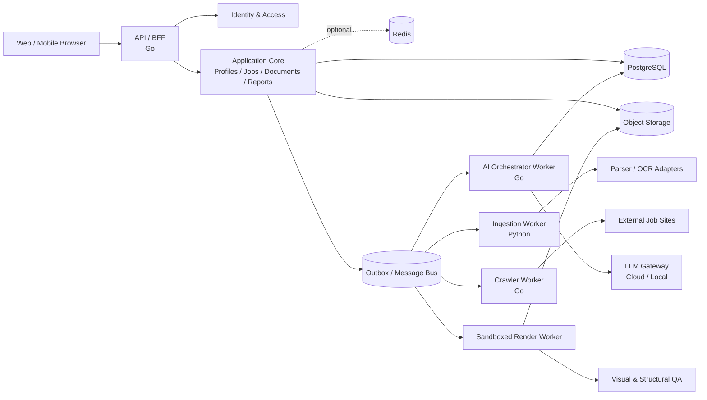
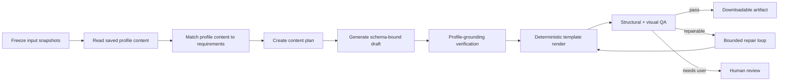

# ResumeGPT Architecture Design

> Status: Draft  
> Target stage: Prototype / MVP, with a path to cloud-native distributed deployment  
> Primary product language: English, with support for additional locales  
> Last updated: 2026-09-14

## 1. Goals and Design Principles

ResumeGPT uses user-maintained profile content and job postings to generate, optimize, and manage tailored CVs and cover letters. In addition to producing high-quality content, the system must keep the user's saved profile authoritative, minimize fabricated claims, and reliably execute long pipelines involving file parsing, web crawling, LLM calls, template rendering, and visual validation.

Core principles:

1. **Saved profile first:** Models generate from the profile text explicitly saved by the user. Imported text is only a draft until the user saves it.
2. **Business logic is infrastructure-independent:** LLMs, object storage, relational/vector databases, message systems, parsers, and renderers are accessed through ports and adapters.
3. **Start as a modular monolith, split on measured need:** The MVP uses a modular API plus independently deployable workers. Extract services only where scaling, security, ownership, or reliability requires it.
4. **Asynchronous and recoverable:** Long-running work uses durable jobs with idempotency, retries, deadlines, cancellation, and recovery.
5. **Structured generation first:** LLMs produce schema-constrained content; deterministic template engines produce DOCX, TeX, and PDF.
6. **Privacy by default:** Minimize collection and design tenant isolation, encryption, audit, export, and deletion from the outset.
7. **Observable, replaceable, and testable:** Record model, prompt, input snapshot, cost, latency, and quality signals so provider changes and regressions are measurable.

## 2. Scope and Non-Goals

### 2.1 MVP Scope

- Multiple editable profiles with role metadata, optional avatars, and direct text entry.
- Review-before-save text extraction from PDF, DOC/DOCX, TeX, Markdown, TXT, PNG, and JPG/JPEG files.
- Single or batch job URL import plus manual job entry.
- Job details, tags, application-state tracking, and basic reporting.
- CV generation and revision by profile, job, template, and page constraint.
- Cover-letter generation and revision by profile and job.
- DOCX/PDF output, plus TeX template input and PDF output.
- Profile-grounding validation, layout validation, visual checks, version comparison, and download.
- Multiple cloud providers and local models exposed through compatible adapters.
- English-first UI with independent UI and document-language selection.

### 2.2 MVP Non-Goals

- Automated application submission, automatic login to job sites, or bypassing access restrictions.
- Sending email, applying, or mutating an external ATS without explicit user action.
- Training or fine-tuning a foundation model.
- Universal pixel-perfect support for arbitrary PDF, DOCX, or TeX templates. The MVP supports a validated subset.

## 3. Recommended Architecture

### 3.1 Prototype Deployment Shape

Use a **modular-monolith API, asynchronous workers, and an isolated rendering sandbox**:

- `web-app`: TypeScript and Vue 3.
- `api`: Go domain logic, REST/JSON API, authorization, and workflow entry points.
- `worker-go`: crawling, orchestration, notifications, and reporting aggregation.
- `document-worker`: Python OCR, document parsing, selected NLP utilities, and PDF image analysis.
- `render-worker`: isolated LibreOffice, LaTeX, Chromium, and font toolchain.
- PostgreSQL: system of record.
- Object storage: uploads, artifacts, previews, and diagnostic attachments; MinIO is suitable locally.
- Optional Redis: caching, rate limits, ephemeral state, and distributed locks when measured load requires it; never the sole record of user content.
- Messaging: begin with PostgreSQL Outbox and lightweight workers; add Kafka when multiple consumers or throughput justify it.
- Vector search: do not deploy it for the simple Profile model. Add a PostgreSQL/pgvector adapter only if measured generation quality or input size justifies retrieval, and evaluate Qdrant only at scale.



### 3.2 Why Not Start with Full Microservices

Before domain boundaries and workload profiles stabilize, full microservices add service discovery, distributed transactions, event compatibility, integration testing, observability, and operations overhead. A modular monolith preserves code boundaries while allowing high-risk and compute-heavy workers to deploy separately.

Extract a service when:

- URL acquisition, OCR, or rendering needs a distinct resource or isolation policy.
- Generation and interactive API traffic require different SLOs.
- A domain needs an independent team, release cadence, or governance boundary.
- Profiling shows a module is a bottleneck and vertical scaling is uneconomical.

## 4. Domains and Module Boundaries

| Module | Responsibilities | Core entities |
|---|---|---|
| Identity & Tenant | Authentication, sessions, workspaces, membership, RBAC, quotas | User, Workspace, Membership |
| Profile | Editable profile metadata, text, avatar reference, and document import | Profile, DocumentUpload |
| Job | Editable Job records, current application status, manual entry, and safe background URL import | Job, JobImportTask |
| Template | Simple resume/cover-letter TeX and Word library, original files, and extracted text | Template |
| Content Generation | Planning, profile selection, generation, conversational revision | Generation, ArtifactDraft, Revision, Conversation |
| Validation | Profile grounding, content rules, ATS, layout, and visual validation | ValidationRun, Finding, ProfileReference |
| Artifact | Rendering, preview, conversion, download, retention | Artifact, FileVariant, RenderRun |
| Platform | Providers, jobs, audit, configuration, notification, throttling | ProviderConfig, JobRun, AuditEvent |

Modules communicate through application interfaces and domain events. They must not directly read another module's private tables. Initially they may share a PostgreSQL instance, but table ownership must be separated by schema or explicit naming.

## 5. Layers and Adapter Design

Use hexagonal architecture:

```text
Transport (HTTP / Event Consumer / CLI)
                 |
Application Use Cases + Workflow Orchestration
                 |
Domain Model + Policies + Interfaces (Ports)
                 |
Infrastructure Adapters
(Postgres / Qdrant / Kafka / LLM / S3 / OCR / Renderer)
```

The business layer depends only on interfaces it owns:

```go
type TextGenerator interface {
    Generate(ctx context.Context, req GenerateRequest) (GenerateResult, error)
    Stream(ctx context.Context, req GenerateRequest) (TokenStream, error)
    Capabilities(ctx context.Context) ModelCapabilities
}

type EmbeddingProvider interface {
    Embed(ctx context.Context, texts []string) ([]Vector, error)
}

type VectorIndex interface {
    Upsert(ctx context.Context, entries []VectorEntry) error
    Search(ctx context.Context, query VectorQuery) ([]VectorMatch, error)
    DeleteNamespace(ctx context.Context, namespace string) error
}

type BlobStore interface {
    Put(ctx context.Context, object BlobObject) (BlobRef, error)
    Open(ctx context.Context, ref BlobRef) (io.ReadCloser, error)
    SignedDownloadURL(ctx context.Context, ref BlobRef, ttl time.Duration) (string, error)
}
```

Define ports for:

- `LLMProvider`, `EmbeddingProvider`, and `Reranker`.
- Profile, Job, and Artifact repositories.
- `VectorIndex`, `BlobStore`, `Cache`, and `EventBus`.
- `DocumentParser`, `OCRProvider`, and `JobPageFetcher`.
- `TemplateRenderer`, `VisualInspector`, and `MalwareScanner`.
- `IdentityProvider`, `SecretStore`, and `TelemetrySink`.

Generation inputs reference the explicitly selected LLM connection ID and model name. Provider-specific request details stay behind adapters.

## 6. Core Data Model

Primary tables include an ID (UUID/ULID), `workspace_id`, and timestamps. Profiles use straightforward CRUD and are hard-deleted from the active database; object and backup cleanup follows the retention policy. Immutable snapshots and versions are introduced only for workflows, such as generation, that require reproducibility.

### 6.1 Profiles

- `profiles`: name, target role, default language, one Markdown-friendly text body, and an optional avatar object identifier.
- `document_uploads`: quarantined object reference, declared media type, processing state, durable job reference, extracted text, and actionable error details.

The saved profile text is the authoritative input for generation. Direct edits update it through an explicit save operation. Document extraction writes only to `document_uploads.extracted_text`; the browser loads that result into the editor and the user decides whether to save it. PostgreSQL remains authoritative if embeddings are added later as a rebuildable optimization.

### 6.2 Jobs and Application Tracking

- `jobs`: editable title, company, location, country, city, work mode, employment type, source URL, description, application status, import state, and actionable import error.
- `durable_jobs`: background URL acquisition with leases, bounded retries, and idempotency by normalized source URL.

The Job row is the authoritative record. Manual creation writes it immediately. URL import creates a placeholder Job and a durable task in the same transaction, then fills the same editable record after extraction. There is no review, approval, source-version, or Job-snapshot lifecycle in this personal-project module.

Supported application statuses are intentionally lightweight:

```text
interested -> preparing -> applied -> screening -> interview -> offer -> accepted
                              |            |          |
                              +----------> rejected <-+
interested/preparing/applied -> withdrawn
```

Users may change the current status freely. Status history, custom workflow configuration, reporting, notes, reminders, and separate application records are outside the current scope.

### 6.3 Templates

- `templates`: name, description, resume/cover-letter type, TeX/LaTeX ZIP/DOC/DOCX source, optional LaTeX entry file, original and PDF-preview object references, extracted text, and processing state.
- A read-only Rezume default is embedded in the API with its author, MIT license, and Overleaf source attribution.
- Custom uploads use durable malware scanning, text extraction, and PDF preview generation before becoming ready.

Templates use ordinary metadata CRUD and have no review, approval, publication, or version lifecycle. A LaTeX source may be one `.tex` file or a ZIP archive containing related `.tex`, style, image, and font assets. ZIP archives default to an unambiguous `main.tex`; users can provide a relative entry path when another file is the compilation root. Archive extraction rejects traversal, symbolic links, encryption, and excessive file counts or expanded sizes. Extracted text is available to later LLM workflows; a generation can copy the selected content into its own immutable input snapshot. The source preview is generated once on upload or source replacement and then loaded directly from object storage. Metadata-only edits do not regenerate it. This preview confirms that the source can be converted, but generation-time rendering and output validation remain separate isolated operations.

### 6.4 Generations and Artifact Versions

The initial implementation uses one `generation_runs` record and one reusable durable job per application. A run freezes the selected Profile, Opportunity, Template, and model choices as JSON snapshots. Append-only `generation_steps` preserve configuration changes, writer drafts, each rendered PDF and LaTeX source, reviewer feedback, workflow warnings, and user follow-up prompts in display order. The default single-model mode assigns one model to writing, LaTeX rendering, and visual review; advanced mode assigns those roles independently. Stage changes are persisted as writing, rendering, reviewing, repairing, ready, or failed. Ollama responses are consumed as a stream, and each role has a bounded output-token budget so local models cannot leave a worker waiting indefinitely for an unbounded response.

The writer, template applier, visual reviewer, and layout polisher use LangChainGo's standard agent executor with a bounded ReAct tool loop. A provider-neutral `llms.Model` adapter preserves ResumeGPT's encrypted OpenAI, OpenAI-compatible, and Ollama connection runtime. Each role receives a least-privilege tool set: immutable generation context, complete template-source reading, sandboxed PDF compilation, or bounded PDF-to-image conversion. The template applier must read the source project before it may compile a candidate, so it can identify the intended entry structure, custom macros, examples, local assets, and portrait mechanism. Artifact storage uses the same tool contract but remains processor-controlled. Agents cannot access infrastructure adapters directly, and the durable processor retains deterministic stage ordering and repair bounds.

LaTeX generation replaces only the selected entry source in a multi-file ZIP, preserves its assets, and compiles in the isolated document worker. A saved PNG or JPEG Profile avatar is injected beside the entry file under a stable `resumegpt-avatar.*` filename; the agent uses the template's own photo facility when one exists. Single-file templates are packaged with the avatar in a temporary LaTeX ZIP for the same relative-path behavior. The generated PDF is rasterized for visual review. Exact page targets are checked deterministically, while a vision-capable reviewer checks alignment, clipping, glyphs, spacing, and composition. Reviewer or compiler feedback may trigger at most two renderer repairs. If the selected provider explicitly reports that its model cannot accept image input, the run skips model-based visual review, stores the successfully rendered PDF, and shows a persistent warning to the user. Other reviewer failures remain actionable run failures. Word generation remains deferred until a structured DOCX renderer can preserve template styling.

After a run is ready, the user may submit a bounded follow-up prompt. The same run returns to the queue with its grounded draft, current LaTeX, frozen model choices, and new instruction. The previous timeline and intermediate PDF objects remain available, while the newly completed artifact becomes the current download.

A completed or failed application may also be reconfigured with another Profile, compatible Template, or set of LLM model choices. Reconfiguration refreshes the input snapshots, clears the current working result, appends a configuration-change step, and queues a full run from the writer stage. Previous timeline entries and intermediate PDFs remain available. Active applications reject concurrent reconfiguration. The UI presents this append-only history in a fixed-height, independently scrollable timeline that defaults to newest-first order and exposes the active stage as an animated timeline node.

The Job Opportunities list supports reusable item selection and a shared bulk-action bar. A user can create a CV or cover letter directly from one card or select up to 50 ready opportunities and choose one Profile, compatible Template, and model configuration for the batch. The browser submits one ordinary generation command per opportunity, so every result retains an independent run, snapshot, durable task, timeline, retry path, and failure state. Partial submission failures keep only the failed opportunities in the dialog for a focused retry. The selection primitive is UI-generic so later list modules can add actions such as bulk deletion without rebuilding selection behavior.

- `generations`: task configuration and immutable input-snapshot references.
- `generation_inputs`: profile-content and Job-content copies captured when generation starts, plus template, prompt, and language versions.
- `artifact_drafts`: structured CV/cover-letter content conforming to versioned JSON Schema.
- `artifact_revisions`: parent revision, instruction, diff, and author type.
- `profile_claims`: final claims, supporting profile excerpts, and validation result.
- `render_runs`: renderer/template versions, logs, state, and duration.
- `file_variants`: PDF, DOCX, TeX, and preview-object references.
- `validation_runs/findings`: content, profile-grounding, layout, and security findings.

Record provider, model version, prompt-template version, sampling parameters, and input hash. Raw sensitive prompts follow privacy retention policy.

### 6.5 Settings and LLM Connections

- `workspace_settings`: interface language and System/Light/Dark theme only.
- `llm_connections`: named cloud/local connection mode, provider adapter, Base URL, and encrypted API token.

Settings do not contain generation defaults. Each generation explicitly selects its Profile, Opportunity, connection, model, document type, output language, page target, paper size, and template. The generation input stores those selections without copying the API token.

## 7. Core Workflows

### 7.1 Profile Editing and Document Import

1. Let the user create a profile and enter or paste text directly in the editor.
2. For file import, validate the declared type, filename, and size, then upload to workspace-scoped quarantine storage.
3. Create a durable extraction job and return a pollable upload record.
4. Scan malware, validate the real file type, and extract text with parsers or OCR.
5. Store extracted text on the upload record without changing the profile.
6. Load the result into the browser editor so the user can review and correct it.
7. Update `profiles.content` only after the user explicitly saves.

On failure, retain an actionable processing state. The user can retry with another file or enter text directly.

### 7.2 Job Acquisition

1. Accept up to 50 URLs from the Import via URLs form and let the user explicitly enable AI assistance.
2. In standard mode, normalize and deduplicate public HTTPS LinkedIn and Indeed URLs. Fetch bounded HTML and prefer schema.org `JobPosting` JSON-LD with limited page-metadata fallbacks.
3. In AI-assisted mode, accept public HTTPS job pages and require an explicit saved LLM connection and model for the batch.
4. Create a placeholder Job and durable acquisition task atomically, then return the Job immediately for polling.
5. Start the Job Import Agent with an initial rendered-page snapshot. The agent analyzes the page from the beginning and may use only scoped tools for page inspection, structured metadata, heuristic candidates, visible text, bounded expansion, bounded scrolling, and final structured extraction.
6. Execute browser rendering in the separate Playwright web worker. Revalidate public-network destinations, bound actions and content, and do not give the service database credentials or LLM secrets.
7. Do not authenticate, reuse user sessions, bypass CAPTCHA or access controls, download files, fill forms, or submit applications.
8. Validate and sanitize the Agent's schema-bound result, then update the same editable Job. Mark incomplete or inaccessible pages with an actionable state so the user can correct fields manually.

Web content is untrusted data. Text telling the model to ignore policy, reveal information, or invoke unrelated tools never becomes an instruction. The Agent does not receive arbitrary network, filesystem, database, or secret access.

### 7.3 CV and Cover-Letter Generation



- Profile reads always filter by workspace and selected profile.
- Build a requirement-to-profile-content matching plan before writing. Missing qualifications cannot be invented.
- Output must conform to the CV/cover-letter IR schema.
- Every experience, number, date, organization, institution, and certificate must be supported by the saved profile snapshot.
- Stronger wording may improve presentation but cannot invent metrics; use non-quantified language when no number is supported.
- User prompts may change style and emphasis, but cannot override truthfulness, security, or tenant isolation.

### 7.4 Conversation and Revision

- Bind a conversation to an artifact revision.
- Every AI change creates a new revision; previous versions remain restorable.
- Use constrained operations such as `replace_bullet`, `reorder_section`, and `shorten_summary`.
- Show semantic, layout, and claim-level diffs.
- Record manual edits as revisions and allow users to lock sections.
- Rerun profile-grounding and render validation before every final download.

## 8. LLM Gateway and Model Policy

### 8.1 Unified Request Model

Normalize chat/responses, streaming, structured JSON, tool calls, context limits, languages, vision, residency, timeouts, retries, concurrency, cost budgets, safety settings, retention, telemetry, and provider error classes.

Providers differ in JSON Schema, vision, and tool support. The user explicitly selects a saved connection and one of its discovered models for each generation.

### 8.2 Provider Adapters

- Implement native cloud adapters and an OpenAI-compatible adapter where appropriate.
- Connect local models through Ollama, vLLM, or another controlled endpoint.
- If semantic retrieval is introduced, configure its embedding provider independently from generation providers.
- Encrypt provider tokens with a deployment-owned key, never return plaintext tokens to clients, and exclude them from logs, traces, audit metadata, and events.

### 8.3 Explicit Selection and Degradation

There is no automatic provider router or fallback group in the personal-project scope. A generation request names one saved connection and model. Persist each generation step under an idempotency key. Missing required writing or rendering capabilities produce an actionable failure. Model-based visual review is best-effort: an explicit image-capability rejection degrades to the deterministic checks and a user-visible warning so a valid PDF remains available.

## 9. Templates, Rendering, and Visual Validation

The Template library described in Section 6.3 stores user-selected source files without an admission or approval workflow. The controls below apply when a generation attempts to render a template, not to everyday library management.

### 9.1 Intermediate Representation

Use format-independent `ResumeDocument` and `CoverLetterDocument` JSON Schemas containing sections, blocks, style tokens, supporting-profile references, and pagination hints. Templates map the IR to DOCX or TeX.

Generation-time template preflight validates:

- File format and macro safety.
- Placeholders and schema compatibility.
- Font availability and licensing.
- Rendering with deterministic fixture data.
- Capabilities such as photo, columns, project count, and headers.

### 9.2 Rendering

- DOCX: populate a controlled template, then convert with isolated LibreOffice.
- TeX: compile an allowlisted template/package set in a networkless, resource-limited container.
- PDF: authoritative delivery/preview format; rasterize each page for visual analysis.
- Templates cannot use shell escape, arbitrary macros, external downloads, or host filesystem access.

### 9.3 Validation Dimensions

Prefer deterministic checks; use vision models as a supplement:

- Target pages, blank pages, overflow, clipping, overlap, and margins.
- Missing fonts, corrupt glyphs, anomalous type size, and contrast.
- Section completeness, links, and date consistency.
- Widows/orphans, headings at page bottoms, excess whitespace, and bullet alignment.
- Text density, hierarchy, and ATS compatibility.
- Normalized PDF text versus IR content to detect lost text.

Limit automatic repairs to two attempts. If constraints still fail, present findings and let the user shorten content, switch templates, or accept the result.

## 10. AI Security and Fabrication Prevention

### 10.1 Threat Model

- Prompt injection in uploads, job pages, and user prompts.
- Fabricated experience, education, skill, metrics, dates, or contact information.
- Cross-user or cross-profile retrieval leakage.
- Malicious DOCX/TeX, parser vulnerabilities, SSRF, and browser escapes.
- Third-party retention or training on personal data.
- PII leakage through logs, traces, and errors.
- Bias, discriminatory inference, or inappropriate use of sensitive traits.

### 10.2 Anti-Fabrication Controls

1. Freeze the exact saved profile content used by each generation.
2. Retrieve profiles only within the active workspace and require an explicit profile selection.
3. Require generated claims to cite supporting profile excerpts; unsupported high-risk claims fail by default.
4. Deterministically compare names, dates, numbers, and enumerated values.
5. Use an independent semantic check for unsupported expansion, but never an LLM as the sole judge.
6. Treat identity, organization, title, dates, education, certification, and metrics as blocking-risk claims.
7. Ask the user to add or correct profile text when required information is missing or ambiguous.
8. Block `Verified` export with unresolved claims; explicit unverified export is audited and policy-controlled.

```json
{
  "text": "Reduced report preparation time by 30% through automation.",
  "profile_id": "prof_01...",
  "supporting_excerpt": "Automated the monthly reporting workflow...",
  "verification": "verified",
  "risk": "high"
}
```

### 10.3 Prompt-Injection Isolation

- Separate system policy, user instructions, profile content, and job text into explicit trust boundaries.
- Uploaded and crawled text is always untrusted and cannot invoke tools.
- Tools use an allowlist, typed arguments, and server-side authorization. Models cannot choose arbitrary URLs, SQL, paths, or workspace IDs.
- Enforce retrieval scope in storage/repository code, not through model instructions.
- Persist official revisions only after schema, content-policy, and profile-grounding validation.

## 11. Security, Privacy, and Compliance Baseline

- OIDC/OAuth 2.1 authentication; short-lived workload identity for service-to-service access.
- Workspace scoping in repositories plus PostgreSQL RLS as defense in depth.
- TLS in transit and encryption for databases, object storage, backups, and sensitive fields at rest.
- Short-lived signed upload/download URLs and unguessable object IDs.
- Audit upload, download, generation, export, deletion, and provider changes.
- Redact logs; never log full CVs, JDs, prompts, model responses, or signed URLs.
- Support export and deletion across database, object store, vector index, caches, and backups according to retention.
- Show provider processing/residency settings; allow a sensitive profile to require local models.
- Disable public sharing by default; make any link revocable, expiring, and auditable.
- Perform a formal GDPR/UK GDPR assessment for target markets; retain consent, purpose, and retention fields even in the prototype.

## 12. Asynchronous Work, Errors, and Fault Tolerance

### 12.1 Job State

```text
queued -> running -> succeeded
             |  \-> retry_wait -> running
             +---> failed
             +---> cancelled
```

Each job records type, idempotency key, input references, attempt count, maximum retries, deadline, heartbeat, error class, and trace ID. Store large payloads in object storage.

### 12.2 Consistency

- Write business data and outbox events in one PostgreSQL transaction.
- Publish the outbox to messaging; consumers use inbox/deduplication records.
- Use at-least-once delivery and idempotent effects.
- Artifact versions are immutable; state transitions use optimistic locking.
- Any vector index is rebuildable derived data; saved profile content remains authoritative in PostgreSQL.

### 12.3 Error Policy

| Error | Handling |
|---|---|
| Invalid schema or unsupported file | No retry; return an actionable message |
| Provider 429 or transient 5xx | Exponential backoff with jitter; honor Retry-After |
| Timeout/network interruption | Bounded retry with idempotency |
| Authentication, balance, or policy rejection | Fail fast and notify the appropriate party |
| Parser crash or malicious input | Quarantine and record a security event |
| Page constraint failure | Bounded repair, then human decision |
| Optional Kafka/vector service unavailable | Retain outbox work; PostgreSQL remains authoritative |

Also use circuit breakers, bulkheads, provider concurrency limits, leases/heartbeats, dead-letter handling, audited replay, and graceful shutdown.

## 13. API and Events

### 13.1 External API

Use versioned REST for the MVP, SSE for generation progress, and signed URLs for uploads:

```text
POST   /v1/profiles
GET    /v1/profiles
GET    /v1/profiles/{id}
PUT    /v1/profiles/{id}
DELETE /v1/profiles/{id}
POST   /v1/profiles/{id}/avatar-upload
GET    /v1/profiles/{id}/avatar
POST   /v1/profiles/{id}/document-uploads
POST   /v1/profiles/{id}/document-uploads/{upload_id}/complete
GET    /v1/profiles/{id}/document-uploads/{upload_id}

POST   /v1/jobs/imports
POST   /v1/jobs
GET    /v1/jobs
GET    /v1/jobs/{id}
PUT    /v1/jobs/{id}
DELETE /v1/jobs/{id}

GET    /v1/settings
PUT    /v1/settings
GET    /v1/settings/llm-connections
POST   /v1/settings/llm-connections
PUT    /v1/settings/llm-connections/{id}
DELETE /v1/settings/llm-connections/{id}
POST   /v1/settings/llm-connections/{id}/test

GET    /v1/templates
POST   /v1/templates/uploads
POST   /v1/templates/{id}/complete
POST   /v1/templates/{id}/source-upload
GET    /v1/templates/{id}
PUT    /v1/templates/{id}
DELETE /v1/templates/{id}
GET    /v1/templates/{id}/file
GET    /v1/templates/{id}/preview

POST   /v1/generations
GET    /v1/generations
GET    /v1/generations/{id}
PUT    /v1/generations/{id}
DELETE /v1/generations/{id}
POST   /v1/generations/{id}/retry
POST   /v1/generations/{id}/revisions
GET    /v1/generations/{id}/steps
GET    /v1/generations/{id}/steps/{stepId}/artifact
GET    /v1/generations/{id}/artifact

```

Long-running workflow submissions are idempotent and return `202 Accepted`, a resource ID, and a pollable job or upload URL. Simple CRUD operations return ordinary synchronous status codes. Errors return a stable code, message, retryable flag, field errors, and trace ID.

### 13.2 Domain Events

- `profile.created.v1`
- `profile.updated.v1`
- `profile.deleted.v1`
- `profile.document.uploaded.v1`
- `profile.document.extracted.v1`
- `job.created.v1`
- `job.updated.v1`
- `job.deleted.v1`
- `job.import.queued.v1`
- `job.import.completed.v1`
- `settings.updated.v1`
- `llm.connection.created.v1`
- `llm.connection.updated.v1`
- `llm.connection.deleted.v1`
- `generation.requested.v1`
- `artifact.draft.created.v1`
- `artifact.render.completed.v1`
- `validation.completed.v1`

Events contain only necessary IDs, versions, and non-sensitive metadata. Do not broadcast full CVs or PII through Kafka. Event schemas require compatibility policy and a registry.

## 14. Technology Choices

| Layer | MVP recommendation | Evolution | Notes |
|---|---|---|---|
| Web | TypeScript, Vue 3, Vite, Pinia, Vue Router | Nuxt if SSR is needed | SSE fits generation progress; use i18n keys from day one |
| API/domain | Go | Continue with Go | Strong typing, concurrency, and simple deployment |
| Document/OCR | Python worker | Dedicated service | Better document/OCR ecosystem without contaminating the Go domain |
| Workflow | PostgreSQL jobs + Outbox | Temporal or equivalent | Add durable workflow infrastructure only when complexity warrants it |
| OLTP | PostgreSQL | Managed PostgreSQL | System of record; JSONB for evolving typed payloads |
| Vector | Not deployed initially | pgvector, then Qdrant if measured scale requires it | Keep optional and behind `VectorIndex` |
| Cache | Redis when needed | Managed compatible service | Cache, rate limiting, and short locks only |
| Events | Outbox polling | Kafka | Add when event volume/consumer count requires it |
| Objects | MinIO / S3-compatible | Cloud object storage | One `BlobStore` contract |
| Rendering | Sandboxed LibreOffice + TeX + PDF tools | Dedicated render fleet | Pin tools, fonts, and image versions |
| LLM | Provider adapters + local compatible adapter | Policy routing and multi-region | Provider SDK types stay out of business code |
| Auth | Established OIDC provider | Enterprise SSO/SCIM | Do not build a password system |
| Observability | OpenTelemetry, Prometheus/Grafana, structured logs | Managed platform | Trace API, queue, LLM, and rendering end to end |

### 14.1 Go/Python Boundary

Go owns business policy, authorization, orchestration, state machines, APIs, and consistency. Python handles isolated tasks where its ecosystem has a clear advantage, such as OCR, document-structure extraction, and image analysis. Communication uses versioned events or gRPC/HTTP contracts; Python workers do not directly mutate Go-owned business tables.

## 15. Frontend and Internationalization

- English is the default UI locale; use BCP 47 tags such as `en-US`, `de-DE`, and `zh-CN`.
- Store UI locale, profile-content language, job-source language, and target-document language separately.
- Localize dates, numbers, addresses, A4/Letter, and name order.
- Document language is an explicit generation parameter and does not implicitly follow UI locale.
- Templates declare supported languages, fonts, and line-breaking capabilities; test CJK fonts separately.
- Backends return stable error codes; clients localize them. Server-side mail and reports use locale-aware catalogs.
- Preserve source text and locale; do not translate automatically in the storage layer.

## 16. Observability and Quality Evaluation

### 16.1 Runtime Metrics

- API p50/p95/p99 latency, error rate, and active users.
- Queue depth, wait time, retries, and dead-letter count.
- Parsing success, OCR confidence, and Job-import success.
- LLM latency, tokens, cost, schema failures, and fallback rate.
- Generation success, unsupported-claim rate, and human-edit rate.
- Rendering success, page compliance, and visual defects.
- Download conversion and current Job-status distribution.

### 16.2 Offline Evaluation

Maintain a de-identified golden dataset to test:

- Factual consistency and unsupported-claim precision/recall.
- Requirement coverage and keyword-stuffing detection.
- Relevance, concision, grammar, and language quality.
- JSON Schema compliance.
- DOCX/PDF text equivalence, page count, and visual rules.
- Multilingual, long-input, ambiguous-profile, empty-profile, and malicious-prompt cases.

Use evaluation as a release gate. Roll out model changes through shadowing/canaries before broad adoption.

## 17. Deployment and Cloud-Native Compatibility

Local development runs PostgreSQL and object storage in containers; optional Redis or vector services are added only when their owning feature is introduced. Production OCI images must support:

- Twelve-factor configuration with secrets separated from ordinary configuration.
- Stateless APIs, health probes, and graceful shutdown.
- Queue-specific worker scaling and dedicated resources/node pools for rendering or OCR.
- Network policies: renderer has no internet; the web worker can reach only validated public HTTPS destinations; the Go worker reaches configured LLM providers.
- Backward-compatible migrations executed by a release job with rollback planning.
- Object lifecycle policy, PostgreSQL PITR, and tested restoration.
- Multi-AZ first; cross-region disaster recovery depends on later RPO/RTO and cost requirements.

Initial objectives:

- API availability: 99.5%.
- Accepted async jobs survive control-plane restart.
- RPO within 24 hours for early production, improvable to minutes; RTO within four hours.
- Users see progress, cancellation, actionable failure, and retry controls.

## 18. Recommended Repository Layout

```text
ResumeGPT/
  apps/
    web/                    # Vue/TypeScript
    api/                    # Go API composition root
    worker/                 # Go async workers
    document-worker/        # Python parsing/OCR worker
    web-worker/             # Isolated Playwright page renderer
  internal/
    identity/
    profile/
    job/
    application/
    generation/
    template/
    artifact/
    validation/
    reporting/
    platform/
  adapters/
    llm/
    persistence/
    vector/
    blob/
    messaging/
    crawler/
    renderer/
  contracts/
    api/
    events/
    schemas/
  deploy/
    local/
    kubernetes/
  docs/
    adr/
    threat-model/
```

Organize Go packages by domain, not broad horizontal `controllers/services/repositories` folders. Provider SDKs may appear only in adapters or the composition root.

## 19. Delivery Roadmap

### Phase 0: Technical Spikes

- Validate parsing/rendering with representative PDF, DOCX, and TeX samples.
- Define ResumeDocument and CoverLetterDocument JSON Schemas.
- Validate structured output with at least one cloud and one local model.
- Validate profile-grounded generation and PDF page/overflow checks.
- Define the supported template subset and sandbox boundary.

### Phase 1: Single-User MVP

- Editable profiles, optional avatars, and review-before-save document import.
- Job URL/manual import, details, and basic status tracking.
- Initial CV/letter generation, revision, and PDF/DOCX download.
- Basic profile-grounding gate, template rendering, and deterministic visual checks.
- PostgreSQL and object storage; omit Kafka/Qdrant/Redis unless already operationally justified.

### Phase 2: Beta

- Workspaces, collaboration, quotas, audit, and complete deletion.
- Multi-provider routing, budgets, fallback, and local-model policy.
- Optional pgvector/Qdrant retrieval and Kafka/workflow infrastructure only when measured needs justify them.
- Reporting, reminders, multilingual templates, and evaluation pipelines.
- More job-site adapters and stronger compliance management.

### Phase 3: Scale

- Extract ingestion, crawler, generation, and rendering services by workload.
- Kubernetes autoscaling, dedicated rendering/OCR nodes, and multi-AZ deployment.
- Enterprise SSO, fine-grained RBAC, residency, and compliance programs.
- Model shadow/canary rollout, automated quality regression, and cost optimization.

## 20. MVP Simplification

Limit the first deployed system to:

1. Vue web application.
2. Go API and Go worker built from one codebase.
3. Python document worker.
4. PostgreSQL plus S3-compatible object storage.
5. Isolated document and public-page rendering workers.

Keep Redis, Kafka, and optional vector retrieval behind interfaces, but deploy them only when needed:

- Add Redis for demonstrated cache, rate-limit, or coordination load.
- Connect Outbox to Kafka when consumers, throughput, or event-retention needs grow.
- Introduce pgvector only when direct profile input misses measured targets; move to Qdrant only if scale, filtering, or retrieval SLOs later justify it.

This preserves replacement paths without burdening local development, CI, and prototype operations.

## 21. Architecture Decision Records

The ADR index records proposed, accepted, and superseded decisions. Proposed decisions require project-owner acceptance before their implementation becomes authoritative:

1. [ADR-001: Modular Monolith with Independent Workers](./adr/ADR-001-modular-monolith-and-workers.md)
2. [ADR-002: Profile Facts and Evidence](./adr/ADR-002-profile-facts-and-evidence.md) (superseded)
3. [ADR-003: Versioned Document Intermediate Representation](./adr/ADR-003-document-intermediate-representation.md)
4. [ADR-004: Use pgvector for the MVP](./adr/ADR-004-vector-store.md) (superseded)
5. [ADR-005: PostgreSQL Jobs and Transactional Outbox](./adr/ADR-005-durable-jobs-and-workflows.md)
6. [ADR-006: Managed Templates and Sandboxed Rendering](./adr/ADR-006-template-and-rendering-boundary.md) (template management superseded)
7. [ADR-007: Data-Classification-Driven LLM Routing](./adr/ADR-007-llm-data-and-routing-policy.md) (superseded)
8. [ADR-008: Unsupported-Claim Export Gate](./adr/ADR-008-unsupported-claim-gate.md)
9. [ADR-009: Compliant and Constrained Job Crawling](./adr/ADR-009-job-crawling-policy.md) (superseded)
10. [ADR-010: Workspace Tenancy and Authorization](./adr/ADR-010-workspace-tenancy-and-authorization.md)
11. [ADR-011: Simple Editable Profiles](./adr/ADR-011-simple-editable-profiles.md)
12. [ADR-012: Simple Job Tracking and Background URL Import](./adr/ADR-012-simple-job-tracking-and-import.md)
13. [ADR-013: User-Managed LLM Connections](./adr/ADR-013-user-managed-llm-connections.md)
14. [ADR-014: Simple User-Managed Template Library](./adr/ADR-014-simple-template-library.md)

See the [ADR index](./adr/README.md) for status definitions and maintenance rules.

## 22. Acceptance Baseline

Release acceptance baseline:

- Every final factual claim can resolve to supporting text in the saved profile snapshot.
- Changing an LLM provider requires only adapter/configuration changes, not domain changes.
- Adding or changing optional vector retrieval, S3/MinIO, and Kafka/other messaging implementations does not change use-case contracts.
- Upload, Job import, generation, and rendering jobs are idempotently retryable and survive API restart.
- Tests cover malicious URLs, TeX, spoofed MIME types, and prompt injection.
- The system detects page count, overflow, blank pages, clipping, and lost PDF text.
- Every artifact can resolve its exact input snapshots, template, model, and configuration.
- Workspace deletion covers PostgreSQL, object storage, and any optional vector indexes or cache-derived data.
- UI locale and generation language are independent, with end-to-end coverage for English and at least one other language.

---

The central architectural decision is to treat **user-saved profile content in PostgreSQL as the core asset; LLMs as replaceable reasoning and writing components; and DOCX, TeX, and PDF as deterministic renderings of structured content**. This enables rapid prototype delivery while preserving clear paths to replace models, databases, queues, storage, and deployment platforms.
