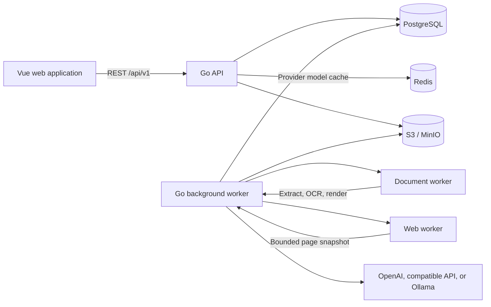
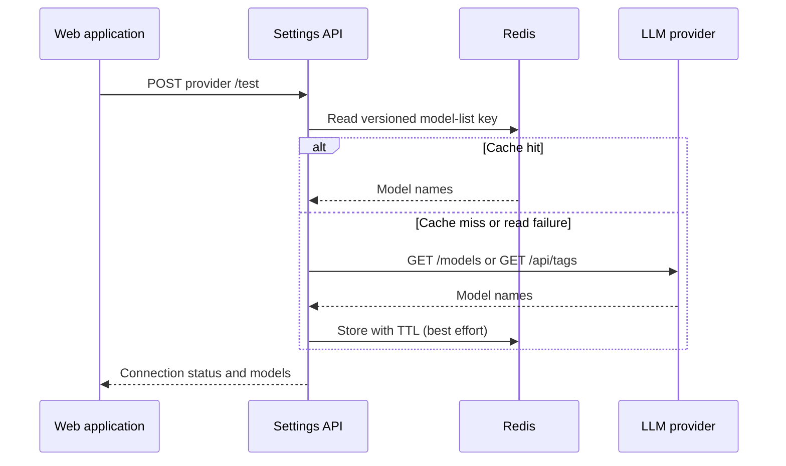
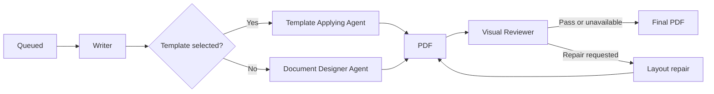

# ResumeGPT Architecture

This document explains the architecture currently implemented in ResumeGPT. It describes the running components, module boundaries, persistence model, background workflows, Agent execution, and security controls represented in the repository today.

## 1. System Overview

ResumeGPT is a self-hosted web application built around a Go modular monolith and a small set of isolated worker services. The browser communicates with one HTTP API. Long-running work is persisted in PostgreSQL and executed by a separate Go worker. File processing and browser automation run in restricted Python containers.



The default Docker Compose deployment includes the web application, API, background worker, migration process, PostgreSQL, Redis, MinIO, document worker, and web worker.

## 2. Runtime Components

### 2.1 Web application

`apps/web` is a Vue 3 and TypeScript single-page application built with Vite and served by an unprivileged Nginx container. It contains the following user-facing areas:

- Overview
- Job Opportunities
- Job Hunter
- Profiles
- Templates
- Create CVs
- Task Monitor
- Settings

The frontend uses Vue Router for navigation, Pinia and Vue state for client state, Vue I18n for localized interface copy, and polling for background workflow progress. English, German, French, Spanish, Japanese, Simplified Chinese, and Traditional Chinese locale catalogs are bundled with the application. The active locale is stored in workspace preferences, applied when the application starts, and can be changed immediately from Settings. Collection endpoints return compact read models rather than complete domain records. Large profile, opportunity, and generation fields are fetched from detail endpoints only when the user opens an item. List pages currently perform their search, filtering, and pagination in the browser, except the Task Monitor, which uses server-side filtering and pagination.

### 2.2 Go API

`cmd/api` starts the public HTTP API. It is responsible for:

- Authentication and workspace authorization.
- Request validation and domain-service invocation.
- Profile, opportunity, template, generation, Hunter, settings, and task-monitor endpoints.
- Issuing short-lived object upload and download URLs.
- Returning generated and intermediate PDFs.
- Structured request logging, request IDs, CORS, panic recovery, and OpenTelemetry HTTP instrumentation.

The API performs short synchronous operations only. Document processing, page import, scheduled searches, and document generation are submitted to the durable queue.

### 2.3 Go background worker

`cmd/worker` runs several processors in one process:

- Profile document extraction.
- Template scanning, extraction, and preview generation.
- Job-page import.
- Job Hunter scheduling and execution.
- CV and cover-letter generation.
- Transactional outbox dispatch.

Each processor claims only its own job kind from PostgreSQL. The generation processor remains on the main worker goroutine, while the other processors and scheduler run concurrently.

### 2.4 Document worker

`services/document-worker` is a Python HTTP service with no database credentials. It provides bounded operations for:

- Malware scanning with ClamAV.
- Text extraction from TXT, Markdown, TeX, DOC, DOCX, PDF, PNG, and JPEG.
- OCR with Tesseract when needed.
- Safe LaTeX ZIP inspection and entry-file handling.
- DOC/DOCX and LaTeX PDF previews.
- PDF page rasterization for visual review.
- Self-contained HTML/CSS rendering to PDF with WeasyPrint.

The container runs read-only with a temporary filesystem. The HTML renderer blocks network and local-file loading; only embedded `data:` resources are accepted.

### 2.5 Web worker

`services/web-worker` is an isolated Playwright service used by the Job Import Agent. It opens public HTTPS pages, captures visible text, metadata, JSON-LD, and a bounded list of interactive controls, and supports a maximum of six scroll or expand actions.

The service blocks private and non-global network destinations, non-HTTPS URLs, non-standard ports, downloads, service workers, images, media, and fonts. It does not receive database credentials or LLM API tokens.

### 2.6 PostgreSQL

PostgreSQL stores domain records, encrypted LLM provider metadata, durable jobs, task events, audit records, outbox records, and generation timelines. Row-level security and application-level workspace filters isolate workspace data.

Repository list queries use dedicated projections so PostgreSQL does not read large text bodies or generation snapshots that the browser will not display. Detail queries continue to return the complete record. This separation reduces database I/O, JSON encoding work, response size, and frontend parsing time without making mutable business records stale through a cache.

### 2.7 Redis

Redis stores expiring results from external LLM provider model-list APIs. Cache keys include the workspace, provider record, and provider update timestamp; the default TTL is ten minutes. Explicit provider tests bypass and refresh the cache.

Redis is enabled when `REDIS_URL` is set. The API verifies the configured Redis connection during startup. A cache read or write failure during a request does not make model discovery unusable: the Settings service falls back to the provider API, and cache writes are best effort. Redis never stores API tokens or complete provider records.

### 2.8 Object storage

S3-compatible object storage contains uploaded documents, profile avatars, template sources, cached previews, intermediate generation PDFs, and final artifacts. MinIO supplies this interface in the local Compose stack.

## 3. Backend Structure

The backend follows ports-and-adapters boundaries inside one Go module:

```text
cmd/                         Process entry points
internal/profile/            Profile domain and service
internal/job/                Opportunity and import domain
internal/hunter/             Scheduled job discovery
internal/template/           Template library and preparation
internal/generation/         Agent workflow and artifact generation
internal/document/           Upload and document-worker integration
internal/settings/           Preferences and LLM providers
internal/taskmonitor/        Read model for durable tasks
internal/identity/           Development and OIDC authentication
internal/adapters/postgres/  PostgreSQL repositories and work queue
internal/adapters/redis/     Expiring external-read cache
internal/adapters/s3/        S3-compatible object storage
internal/adapters/memory/    Lightweight development adapters
internal/platform/           Configuration, database, telemetry, and outbox
internal/transport/httpapi/  HTTP routing and request handling
```

Domain services depend on repository and infrastructure interfaces. The executable entry points select PostgreSQL/S3 or in-memory adapters and connect the concrete implementations.

## 4. Data and Persistence

The active product data is centered on these PostgreSQL records:

| Area | Records |
|---|---|
| Identity | `users`, `workspaces`, `workspace_memberships` |
| Profiles | `profiles`, `document_uploads` |
| Opportunities | `jobs` |
| Job Hunter | `job_hunters`, `job_hunter_review_items` |
| Templates | `templates` |
| Generation | `generation_runs`, `generation_steps` |
| Settings | `workspace_settings`, `llm_connections`, `agent_llm_defaults` |
| Background work | `durable_jobs`, `durable_job_events`, `inbox_messages` |
| Integration and audit | `outbox_events`, `audit_events` |
| Database lifecycle | `schema_migrations` |

Versioned SQL migrations are embedded into the migration binary. The Compose `migrate` service applies them before the API starts.

### 4.1 Workspace isolation

Every user-owned domain record carries a workspace identifier. The API resolves a principal, verifies workspace membership and role, and passes the selected workspace into service and repository calls. PostgreSQL repositories apply workspace-scoped queries, and protected tables use row-level security policies.

Development authentication maps requests to the seeded `ws_personal_dev` workspace. OIDC mode validates bearer tokens against a configured issuer and client ID and requires an explicit workspace selection.

### 4.2 LLM credentials

LLM provider records contain provider type, local or cloud execution mode, Base URL, and encrypted API-token ciphertext. AES-GCM encryption uses `SETTINGS_ENCRYPTION_KEY`. API responses expose only whether a token exists; plaintext tokens are decrypted only when a backend Agent needs the provider.

### 4.3 Collection read models

Collection and detail representations intentionally have different payload sizes:

| Collection | Summary behavior | Loaded on demand |
|---|---|---|
| Profiles | Metadata, a bounded content preview, and `hasContent` | Complete profile text and avatar metadata |
| Job Opportunities | Card metadata and `hasDescription` | Complete job description and editable fields |
| Templates | Metadata and preparation state; source content is omitted | Extracted source, preview, and download information |
| Generations | Inputs by name, state, stage, selected models, timestamps, and `hasWarning` | Frozen snapshots, drafts, rendered sources, reviews, steps, and artifacts |

The boolean presence fields let the frontend enable actions and display readiness without transferring the corresponding large body. Opening an opportunity preview, editor, profile editor, template view, or generation detail triggers its specific detail request. Updating an opportunity status uses a dedicated status endpoint so a list interaction does not first load and then resubmit the full job description.

These collection APIs currently return all compact summaries for client-side search, filtering, and pagination. Server-side pagination remains a future scaling step for the general product lists; the Task Monitor already implements it.

### 4.4 External-read caching

Provider model discovery is read-heavy, relatively slow, and changes infrequently, so it uses a cache-aside flow:



The key contains the workspace ID, provider ID, and provider `updated_at` value. Editing a provider therefore creates a new cache namespace without requiring a broad delete. Normal model-selector requests may use the cached value. An explicit **Test provider** action sends `refresh=true`, bypasses the cached read, verifies the upstream provider, and replaces the cached value after success. Failed provider responses are not cached.

Mutable application collections are not stored in Redis. Their latency is addressed with compact SQL projections and detail-on-demand requests, which preserve immediate consistency after edits and deletes.

## 5. Durable Background Work

The PostgreSQL work queue currently uses these job kinds:

| Job kind | Processor |
|---|---|
| `profile.document.extract.v1` | Profile document extraction |
| `template.extract.v1` | Template preparation and preview generation |
| `job.page.import.v1` | Deterministic or Agent-assisted job import |
| `job.hunt.v1` | Scheduled job discovery |
| `generation.run.v1` | CV and cover-letter generation |

A durable job records its payload, state, availability time, attempt count, maximum attempts, lease owner, lease expiry, error details, and idempotency key. Workers claim jobs with a lease, record lifecycle events, retry retryable failures with backoff, and recover work after an expired lease.

The Task Monitor reads the same records and their persisted events. Its API supports workspace-scoped search, kind and state filters, and server-side pagination. Inputs displayed in the monitor are sanitized before they reach the browser.

## 6. Core Workflows

### 6.1 Profile editing and import

1. The user creates or opens a profile.
2. Text may be entered directly, or a source document is uploaded through a signed object-storage URL.
3. The API creates a `profile.document.extract.v1` job.
4. The Go worker reads the quarantined object and sends it to the document worker.
5. The document worker scans, validates, and extracts text or OCR output.
6. Extracted text is stored on the upload record and loaded into the editor.
7. The profile content changes only when the user explicitly saves it.

A profile stores one authoritative text body plus lightweight metadata and an optional avatar object reference. There is no profile review, approval, or version-management workflow.

### 6.2 Opportunity creation and URL import

Opportunities can be entered manually or imported from URLs.

Standard import accepts public LinkedIn and Indeed URLs, downloads bounded HTML, and extracts `JobPosting` JSON-LD and safe metadata fallbacks. AI-assisted import accepts public HTTPS pages and starts the Job Import Agent with the first rendered snapshot from the web worker. The Agent can inspect metadata, structured data, visible text, expandable controls, and bounded scroll results before returning structured job fields.

URLs are normalized for deduplication. Imported records remain editable, and their source link is retained. Application tracking is a single status field that can be changed directly from the opportunity list or detail page.

### 6.3 Scheduled Job Hunter

The scheduler periodically finds enabled Hunters whose next run is due and queues `job.hunt.v1` work when no run is already active. A Hunter contains search criteria, cadence, result limit, selected LLM provider and model, and an optional profile reference.

The Job Hunter Agent uses a bounded DuckDuckGo search tool and returns candidate job URLs. New normalized URLs are passed into the ordinary job-import workflow. Successfully parsed results appear as Hunter-originated opportunities. Blocked or unparseable pages are stored as review items instead of incomplete opportunities, allowing the user to inspect, manually add, or dismiss them.

### 6.4 Template preparation

1. The browser stages a DOC, DOCX, TeX, or ZIP source through object storage.
2. The API creates a template record and `template.extract.v1` job.
3. The document worker scans and validates the source.
4. Text is extracted for later Agent context.
5. A PDF preview is generated and stored once for the uploaded source.
6. Replacing the source repeats preparation; metadata-only edits do not.

LaTeX ZIP validation rejects traversal, symbolic links, encrypted archives, excessive entries, and excessive expanded size. The user may provide a relative `.tex` entry path; otherwise an unambiguous `main.tex` is used.

The built-in resume template is stored in the Go binary and exposed as a read-only template with its original attribution and license metadata.

### 6.5 CV and cover-letter generation

A generation request names a Profile, Opportunity, document type, language, page target, optional custom instructions, optional LaTeX template, and a model choice for each Agent. New forms normally use the per-Agent defaults from Settings; the user can instead select one model for the whole workflow.

The API validates the inputs, freezes Profile, Opportunity, optional Template, and model snapshots, creates a `generation_runs` record, and queues `generation.run.v1`.



The Writer produces a profile-grounded draft for the selected opportunity. The document path then branches:

- With a template, the Template Applying Agent reads the complete LaTeX project, updates the selected entry source, preserves archive assets, and compiles it in the document worker.
- Without a template, the Document Designer Agent creates a complete, self-contained HTML document with embedded print CSS. The document worker renders it with WeasyPrint. A controlled placeholder can embed the saved profile avatar as a data URL.

The processor validates page count, stores each rendered PDF, rasterizes bounded page images, and asks the Visual Reviewer for structured feedback. The renderer Agent can perform up to two repair rounds. If the model explicitly cannot accept images, visual review is skipped and the valid PDF is retained with a warning. If Agent-generated source remains invalid, the processor uses a safe basic LaTeX or HTML layout.

Every writer draft, rendered PDF, review, warning, configuration change, and user prompt is appended to `generation_steps`. The detail page uses this history for its timeline and intermediate PDF previews. A ready artifact can receive a follow-up revision prompt. A ready or failed run can also be reconfigured and restarted while its previous timeline remains available.

## 7. Agent Runtime

ResumeGPT uses LangChainGo's Agent executor and a provider-neutral model adapter. The adapter connects to:

- OpenAI.
- OpenAI-compatible chat and model-list endpoints.
- Ollama chat and model-list endpoints.

The Settings service discovers models with `GET /models` for OpenAI-style providers and `/api/tags` for Ollama. Each Agent can have its own default connection and model:

- Writer
- Template Applying
- Document Designer
- Visual Reviewer
- Job Import
- Job Hunter

Agents receive role-specific prompts and least-privilege tools. Tool loops, output sizes, browser actions, rendering attempts, and repair rounds are bounded. Database writes, artifact storage, workflow transitions, and final validation remain controlled by deterministic application code rather than by an Agent.

## 8. Security Boundaries

### 8.1 File processing

- Uploaded content enters quarantine storage through a short-lived signed URL.
- File type checks use signatures as well as filenames and declared media types.
- ClamAV must succeed before extraction or preview generation continues.
- DOCX and ZIP expansion limits protect against oversized archives.
- LaTeX archives reject path traversal, symbolic links, and encryption.
- The document-worker container is read-only and receives no database credentials.

### 8.2 Network access

- Job import accepts HTTPS source URLs only.
- DNS results are checked before network access.
- Private, loopback, link-local, reserved, and non-global addresses are rejected for public browsing.
- Redirects, response size, content type, timeouts, and browser actions are bounded.
- The web worker cannot authenticate to sites, reuse a user's browser session, bypass CAPTCHA, download files, or submit applications.
- Generated HTML cannot fetch remote or local resources.

### 8.3 Authorization and secrets

- HTTP endpoints require Viewer, Editor, or Owner roles according to the operation.
- Workspace IDs scope repository access and signed object operations.
- LLM tokens are encrypted at rest and omitted from API responses, logs, task inputs, events, and traces.
- Container services run without added Linux capabilities and use `no-new-privileges`.

## 9. Reliability and Observability

- API and service containers expose health checks used by Docker Compose dependencies.
- Database migrations run as a one-shot service before API startup.
- Queue leases and retries recover interrupted background work.
- Inbox records prevent duplicate asynchronous side effects.
- Transactional outbox records are dispatched with stable event IDs and retry backoff.
- Core mutations persist audit events.
- External provider model discovery uses a bounded Redis TTL and falls back to the upstream provider when an in-request cache operation fails.
- API and worker logs use structured JSON.
- OpenTelemetry instruments HTTP requests and propagates W3C trace context. Spans are exported when `OTEL_EXPORTER_OTLP_ENDPOINT` is configured.
- Backup and restore-check scripts operate on the local PostgreSQL deployment.

## 10. Deployment Modes

### 10.1 Docker Compose

The supported complete local deployment is:

```bash
docker compose up -d --build
```

Compose supplies PostgreSQL and S3 persistence, Redis caching, development authentication, migrations, health checks, and internal service URLs. The API waits for healthy PostgreSQL, Redis, and migration services before starting. The browser application is available at `http://localhost:5173`.

The Compose API uses `redis://redis:6379/0`. `MODEL_CACHE_TTL` controls the model-discovery lifetime and defaults to `10m`; `REDIS_PORT` controls optional host access to Redis. PostgreSQL, Redis, and MinIO each use a named volume.

### 10.2 Host development

The API can use in-memory repositories and storage by setting `PERSISTENCE_MODE=memory` and `OBJECT_STORAGE_MODE=memory`. This mode supports lightweight backend and UI work, but durable uploads, generation, task monitoring, and the complete worker workflows require PostgreSQL, object storage, and the isolated services.

### 10.3 Authentication modes

- `development`: uses a fixed local subject and the seeded personal workspace.
- `oidc`: validates bearer tokens using the configured issuer and client ID, then resolves workspace membership and role from PostgreSQL.

## 11. Current Product Boundaries

- Profile content is stored directly in PostgreSQL and passed from a frozen snapshot; no vector database is active.
- Generation currently applies ready LaTeX templates. Word templates can be uploaded, inspected, and previewed, but are not used as generation-time layout sources.
- Visual review depends on the selected model's image capability and degrades to a warning when unsupported.
- Job crawling covers public content only and does not bypass access controls.
- General list views use compact collection read models with client-side pagination; the Task Monitor uses server-side pagination.
- Redis currently caches external provider model lists only; it is not a general domain-record or session cache.
- Generation progress is polled by the browser rather than streamed.
